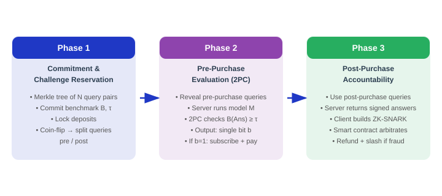
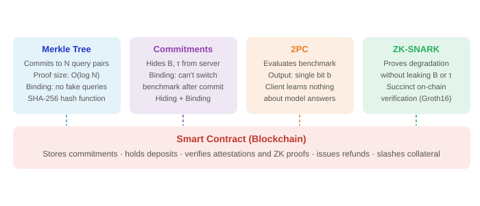
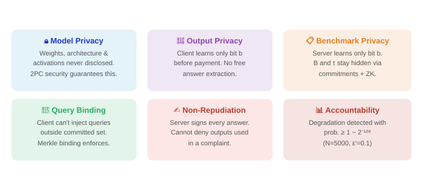
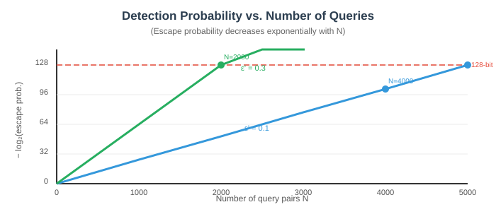
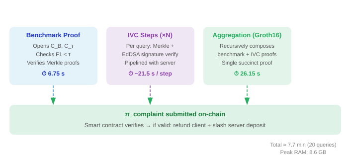
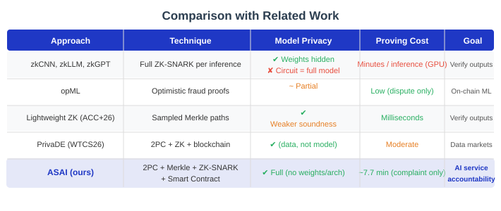

# Secure and Private Benchmarking for Subscription-Based AI Inference Services

Vincenzo Botta, Ivan Visconti, **Andrea Vitaletti**, Marco Zecchini
*Sapienza University of Rome*

---

# The AI Inference Service Market

- AI models are increasingly accessed via **subscription-based APIs**
- A typical workflow:
  1. Client evaluates model quality during a **free trial**
  2. Client subscribes and **pays** for continued access

---

# A Two-Sided Vulnerability

**Malicious Server can:**
- Use a strong model during trial, swap to a weaker one after payment
- Replay cached answers if client repeats queries

**Malicious Client can:**
- Extract needed answers during evaluation, then claim quality is too low
- Fabricate complaints to get refunds

---

# Problem Statement

**Goal:** Design a protocol that simultaneously guarantees:
- The client cannot extract useful answers without paying
- The server cannot (i.e. it will be caught) degrade quality after payment
- Efficient mechanism (current solutions are too complex and inefficient)

### :bulb: Key Insight

Separate the query set into **pre-purchase** and **post-purchase** subsets via a **public coin flip**, committed before any model output is seen.

A smart contract on a blockchain acts as a **neutral, incorruptible arbiter**.

---

# Protocol Phases

---

# Phase 1 — Commitment & Challenge Reservation

- Client constructs **N pairs** of queries: $(q_i^{(0)}, q_i^{(1)})_{i=1}^{N}$
- Builds a **Merkle tree** over all $2N$ leaves and publishes root $R_Q$
- **Fair coin-toss** → public bit string $r \in \{0,1\}^N$
  - which query is **pre-purchase** ($\{q_i^\text{pre}\}_{i=1}^N$.) vs **post-purchase** ($\{q_i^\text{post}\}_{i=1}^N$.)
- Neither party can bias the split

- Commits to benchmark $C_B = \text{Com}(r; r_r)$ and threshold $C_\tau = \text{Com}(\tau; r_\tau)$
- Both parties **lock deposits** into a Smart Contract S

---

# Phase 2 — Private Pre-Purchase Evaluation (2PC)

1. Client reveals $\{q_i^\text{pre}\}_{i=1}^N$ with Merkle proofs (proves queries belong to committed set)
2. Server runs model M → produces $\text{Ans}^{pre}$, submits signed commitment $\sigma_1$
3. **Two-Party Computation** evaluates $B(\text{Ans}^{pre}) \geq \tau$ with private inputs on both sides

### :white_check_mark: Output: a single bit b

If $b = 1$: joint attestation α submitted on-chain → client subscribes and pays.

If $b = 0$: no attestation produced, no payment.

Only the **decision bit b** is revealed: no model outputs, no benchmark details.

---

# Phase 3 — Post-Purchase Accountability

If the client suspects model degradation after paying:

1. Client sends post-purchase queries $\{q_i^{post}\}$ to server
2. Server returns **signed answers** $\sigma_i = \text{Sign}_{sk_{Ser}}(H(q_i^{post}), a_i)$
3. Client constructs a **ZK-SNARK proof** $\pi_{complaint}$ certifying:
   - Correct openings of $C_B$, $C_\tau$, Merkle proofs
   - All server signatures are valid
   - $B(\{q_i^{post}\}, \{a_i\}) < \tau$

### :gear: Smart Contract Arbitration
If $\pi_{complaint}$ verifies → **refund client + slash server deposit**

---

# Building Blocks

---

# Scurity Properties

---

# Detection Probability: Chernoff Bound Analysis

Let $\varepsilon' = \tau - (1-\varepsilon)$ be the **degradation gap**. 

By the Chernoff bound:

$$\Pr[\text{post-purchase score} \geq \tau] \leq \exp\!\left(-\frac{N\,\varepsilon'^2}{2\mu + \varepsilon'}\right)$$

The **larger the degradation**, the **fewer queries** needed to catch it.

---

# ZK SNARKS compliant mechanism

---

**ASAI's features:**
- Does **not** arithmetize the entire neural network
- Provides **pre-purchase** quality assurance (novel)
- Combines 2PC + Merkle + ZK-SNARK + Smart Contract
- Lightweight: ZK proof generated **only if there is a complaint**
- Fully **model-agnostic** (black-box access to M)

---

# Summary & Contributions

- **ASAI protocol**: first construction providing both pre- and post-purchase accountability for AI inference services
- **Benchmark and output privacy**: only a single bit disclosed before payment
- **On-chain arbitration**: smart contract enforces refunds and collateral slashing without trust in any party
- **Practical viability**: ZK complaint proof in ~7.7 min, fully pipelined, on commodity hardware

---

# Future Directions

- **Benchmark:** how to define a reliable benchmark $(q_i^{(0)}, q_i^{(1)})_{i=1}^{N}$?
- **Reduce 2PC overhead:** explore MPC-in-the-head or VOLE-based protocols for the benchmark evaluation step
- **Formal verification:** machine-checked proofs of the protocol security properties
- **Regulatory compliance:** map ASAI guarantees to emerging AI Act audit requirements

---

# Thank You!

### Questions?

<i class="fa-solid fa-at"></i> botta.vin@gmail.com · visconti@diag.uniroma1.it · vitaletti@diag.uniroma1.it · zecchini@diag.uniroma1.it

<i class="fa-brands fa-github"></i> [https://github.com/marcozecchini/secureVerificationModel](https://github.com/marcozecchini/secureVerificationModel)
