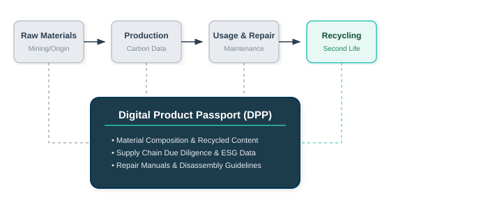
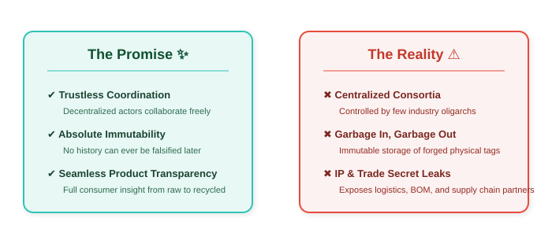
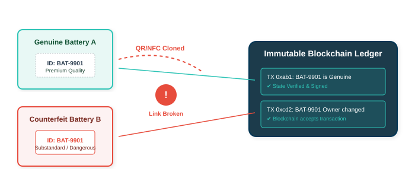
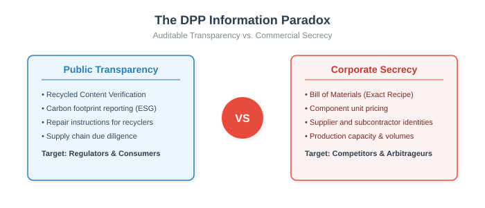
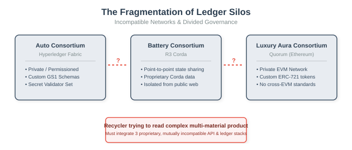
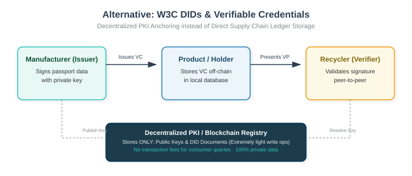

# Blockchain & The Digital Product Passport (DPP)

### A Critical Examination of Technical Bottlenecks, Trust Assumptions, and Governance Silos

**Andrea Vitaletti**
*Sapienza University of Rome*

---

# The Digital Product Passport (DPP) Mandate

- **EU Ecodesign for Sustainable Products Regulation (ESPR)**
  - Requires a "Digital Twin" for batteries, electronics, textiles, and building materials
  - Mandates transparency on material composition, origin, recycling, and carbon footprint

### :link: The Blockchain Hypothesis

Proponents claim blockchain is the *only* solution to:
1. Ensure **immutable** historical tracking across a fragmented, global supply chain.
2. Establish a **decentralized** trust layer where no single firm or nation controls the data.
3. Automatically execute compliance rules via **smart contracts**.

---

# The Promise vs. The Reality

- **The Theory:**
  - Standardized, frictionless, incorruptible decentralized ledger tracking circular lifecycle.

- **The Reality:**
  - High costs, low performance, fragmentation into industry silos, privacy breaches, and zero physical security.

### :warning: The Fundamental Flaw
Blockchains do not secure **facts**; they only secure **records**. If the input data is forged, the blockchain simply records a lie in an immutable, permanent way.

---

# Issue #1: The Physical-Digital Linkage Problem

- **The "Garbage In, Garbage Out" (GIGO) Dilemma**
  - Ledgers are digital, products are physical.
  - Cryptographic signatures guarantee *who* wrote the data, not that the *physical reality* matches the entry.

- **Vulnerabilities of Physical Tags:**
  - **QR Code Copying:** Anyone can photocopy a genuine QR code and paste it on ten low-grade counterfeits.
  - **NFC/RFID Swapping:** Peeling an authentic tag from a degraded battery to bypass circular audits on a new sub-standard batch.
  - **Destruction & Wear:** Tags get damaged in active environments, breaking the passport link entirely.

---

# Issue #2: Privacy, Confidentiality, and Trade Secrets

- **The Transparency Paradox**
  - Regulators/consumers demand complete transparency of supply chains.
  - BUT: A product's **Bill of Materials (BOM)** and supplier registry are **critical trade secrets**.

- **Commercial Threats:**
  - Competitors can reverse-engineer manufacturing processes from material weights and locations.
  - Public shipping transaction logs reveal supplier pricing, production volumes, and margins.

### :lock: The Cryptographic Overhead
Using **Zero-Knowledge Proofs (ZKPs)** to hide data while proving compliance is computationally intensive, increases latency, and complicates key management.

---

# Issue #3: Scalability, Latency, and Financial Costs

- **Transaction Volumes & Network Capacity**
  - EU markets process **billions** of new physical items each year.
  - Tracking every transit, repair, component swap, and recycling event demands high-throughput.

- **The Trilemma Constraint:**
  - **Public Blockchains (e.g., Ethereum L1/L2):** Fees are unpredictable and prohibitively high (e.g., $0.05 to $2.00 per update). Who pays to register a €3 garment's passport?
  - **Private Consortiums:** High throughput and low fees, but they are just centralized databases managed by a cartel of large corporations.

### :money_with_wings: Economic Viability
If the cost of maintaining the digital history exceeds the residual value of the materials being recycled, the circular economy model collapses.

---

# Issue #4: Governance, Standards, and Walled Silos

- **Fragmentation into Silos of Trust**
  - There will never be a single, global "DPP Blockchain".
  - Automotive (Catena-X), Luxury (Aura), and Tech (Battery Alliance) run separate, incompatible networks.

- **Interoperability Failures:**
  - Cross-chain bridging is highly insecure and prone to hacks.
  - Recyclers handling complex e-waste must integrate with dozens of different ledger networks and data schemas.

- **Centralized Cartels:**
  - Private consortia validators are controlled by market leaders, allowing them to freeze records, censor competitors, or set high API fees.

---

# Issue #5: GDPR vs. Blockchain Immutability

- **The Irreconcilable Clash of Law and Architecture**
  - **GDPR Article 17:** The "Right to be Forgotten" mandates the erasure of personal data on request.
  - **Blockchain Core Feature:** Permanent, non-deletable history.

- **How Personal Data Leaks Into the Passport:**
  - Ownership transfers of premium goods (e.g., e-bikes, luxury watches) identify buyers.
  - Repair and maintenance logs contain the names, licenses, and locations of technicians.

### :scissors: The Failure of "Off-Chain Hashing"
If we store data off-chain and only keep hashes on-chain, deleting the off-chain data to comply with GDPR leaves broken hashes on-chain, permanently destroying the ledger's semantic integrity.

---

# Alternative Architecture: Do We Need a Blockchain?

- **W3C Standards: DIDs & Verifiable Credentials (VCs)**
  - A secure, standard, federated approach that requires **no** global transaction consensus ledger.

- **How it works:**
  - **Issuer:** Manufacturer signs the passport payload (JSON-LD) using a private key.
  - **Holder:** The product (or its digital wallet) stores the signed VC off-chain.
  - **Verifier:** Recycler verifies the cryptographic signature peer-to-peer.
  - **Decentralized PKI:** Blockchain is used ONLY as a directory for public keys (DID Documents).

### :shield: Benefits of DID/VC over Direct Blockchain Storage
- **Zero transaction fees** for supply chain updates.
- **Perfect privacy** (data is exchanged peer-to-peer, not publicly broadcast).
- **Infinite scalability** (standard web protocols).

---

# Discussion Prompts for the Audience

- **1. The Liability of the GIGO Link:**
  - *Scenario:* A recycler relies on an immutable battery passport stating a battery has 80% cobalt. In reality, it was swapped with a counterfeit lead-acid tag and explodes. Who is legally liable: the manufacturer, the ledger validators, or the recycler?

- **2. The Threat of Consortium Metadata:**
  - *Scenario:* Five major car manufacturers operate a permissioned consortium blockchain for automotive passports. Can they analyze the metadata (transaction frequencies, shipping latency) of independent suppliers to force price reductions or squeeze out smaller competitors?

- **3. The Carbon Paradox:**
  - *Scenario:* A digital passport tracks a circular t-shirt. Recording raw materials, dyeing, sewing, shipping, and second-hand sales takes 5 blockchain transactions. Does the energy footprint of validating these transactions exceed the carbon offset of recycling the t-shirt?

---

# Paradigm Comparison

| Criteria | Centralized Database (EU Registry) | Consortium Blockchain | Public Blockchain (L2) | DIDs + VCs (Decentralized PKI) |
| :--- | :---: | :---: | :---: | :---: |
| **Trust Model** | Trust in government | Trust in industry cartel | Math + Miner/Validator set | Cryptographic peer-to-peer |
| **Data Privacy** | High (controlled access) | Medium (leaks to rivals) | Extremely low (public) | **Excellent (off-chain)** |
| **Write Cost** | Negligible | Low | High &amp; Unstable | **Zero** |
| **Scalability** | High | Medium | Low | **Infinite** |
| **GIGO Security** | Checked at input | Checked by consortium | Unchecked | Checked by peer-to-peer audit |

---

# Thank You!

### Let's Open the Critical Discussion

- Is the blockchain hype in circular economy projects just a distraction from standardizing data formats?
- How can we solve the physical-digital linkage without expensive tamper-proof hardware?
- Can circular regulations survive without a centralized state enforcement agency?

<i class="fa-solid fa-at"></i> vitaletti@diag.uniroma1.it
<i class="fa-solid fa-globe"></i> [https://www.diag.uniroma1.it/vitaletti/](https://www.diag.uniroma1.it/vitaletti/)
