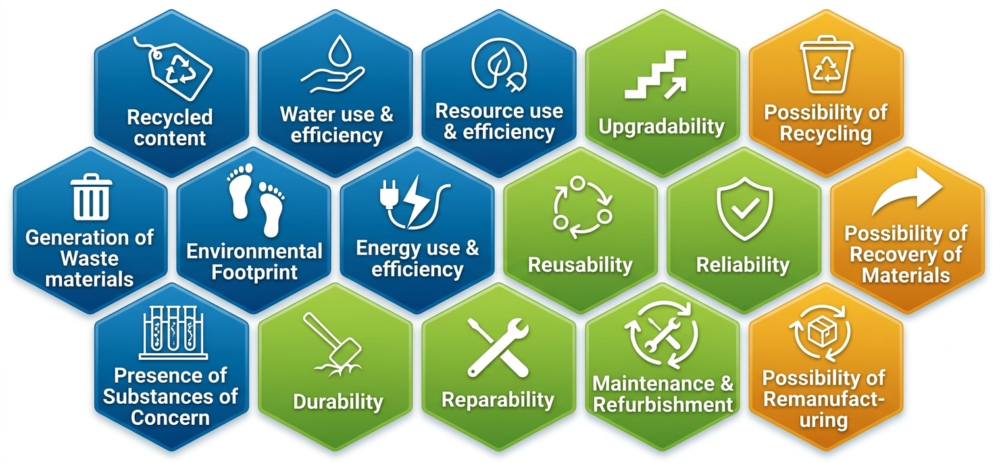
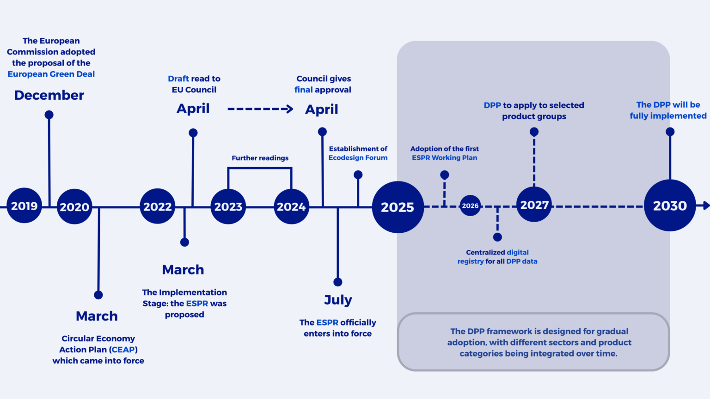
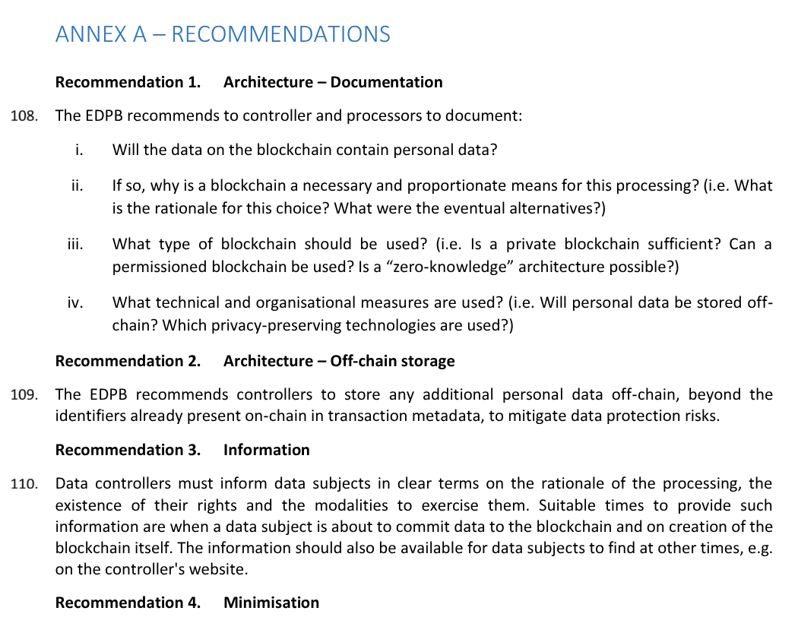

# Digital Product Passport

### A no-nonsense discussion on the blockchain-based perspectives

Ilaria Lunesu; Lodovica Marchesi; Andrea Pinna; Roberto Tonelli; **Andrea Vitaletti**

---

### :warning: More questions than answers

... and this is only a limited number of relevant questions!

---

# Ecodesign for Sustainable Products Regulation (ESPR)

--- 

# Digital Product Passport

 > It is a comprehensive standard (e.g. [GS1 Arch](https://gs1.eu/wp-content/uploads/2022/08/Digital_Product_Passport_Architecture_GS1inEurope_March_2022.pdf), [GS1 GSCN](https://ref.gs1.org/standards/genspecs/gscn/2023/Provisional-GSCN-23-103-DP.pdf)) digital record that tracks a product’s lifecycle, materials, origin, and environmental footprint to promote a circular, sustainable economy.

---

# DPP Roadmap

--- 

# The opportunity

| Target Industry / Milestone | Key Timeline & Focus |
| :--- | :--- |
| **Batteries** | Operational starting February 2027 for industrial and EV batteries under separate battery rules. |
| **Priority Sectors** | First wave includes Iron, Steel, Textiles, Apparel, Aluminium, and Furniture (Adoptions spanning 2026–2028). |
| **Secondary Wave** | Expected rollout for Tyres, Mattresses, and Electronics by 2027–2029. |
| **Universal Mandate** | By 2030, the DPP framework is expected to cover nearly all regulated consumer and industrial goods. |

---

# :link: The Blockchain Hypothesis

Proponents claim blockchain is the *only* solution to:
1. Ensure **immutable** historical tracking across a fragmented, global supply chain: changing one entry means breaking the entire chain
2. Establish a **decentralized** trust layer where no single firm or nation controls the data: DPP  accessible throughout the product's life (tens of years). No company can guarantee its own database will survive that long.
3. Automatically execute compliance rules via **smart contracts**.

---

### :warning: Memento

Blockchain ensures data **integrity**, not data **quality**
If the input data is forged, the blockchain simply records a lie in an immutable, permanent way.

---

# Issue #1: The Physical-Digital Linkage Problem

- **Vulnerabilities of Physical Tags: e.g. QR Code Copying / destruction**
- **The "Garbage In, Garbage Out" (GIGO) Dilemma**
  - Ledgers are digital, products are physical.
  - Cryptographic signatures guarantee *who* wrote the data, not that the *physical reality* matches the entry.

### True in all digital solutions

---

# Issue #2: Privacy, Confidentiality, and Trade Secrets

- **The Transparency Paradox**
  - Regulators/consumers demand complete transparency of supply chains.
- **Commercial Threats:**
  - Competitors can reverse-engineer manufacturing processes from material weights and locations.
  - Public shipping transaction logs reveal supplier pricing, production volumes, and margins.

### :lock: The Cryptographic Overhead
Using **Zero-Knowledge Proofs (ZKPs)** to hide data while proving compliance is computationally intensive, increases latency, and complicates key management.

---

# Issue #3: Scalability, Latency, and Financial Costs

- **Transaction Volumes & Network Capacity**
  - EU markets process **billions** of new physical items each year: tracking every transit, repair, component swap, and recycling event demands high-throughput.
  - **Public Blockchains (e.g., Ethereum L1/L2):** Fees are unpredictable and prohibitively high especially for low cost items
  - **Private Consortiums:** High throughput and low fees, but are they just centralized databases managed by a cartel of large corporations?

### :money_with_wings: Economic Viability
If the cost of maintaining the digital history exceeds the residual value of the materials being recycled, the circular economy model collapses.

---

# Issue #4: Governance, Standards, and Walled Silos

- **Fragmentation into Silos of Trust**
  - There will never be a single, global "DPP Blockchain".
  - Automotive (Catena-X), Luxury (Aura), and Tech (Battery Alliance) run separate, incompatible networks.

- **Interoperability Failures:**
  - Cross-chain bridging is highly insecure and prone to hacks.
  - Recyclers handling complex e-waste must integrate with dozens of different ledger networks and data schemas.

- **Centralized Cartels:**
  - Private consortia validators are controlled by market leaders, allowing them to freeze records, censor competitors, or set high API fees.

---

# Issue #5: GDPR vs. Blockchain Immutability

- **GDPR Article 17:** The "Right to be Forgotten" mandates the erasure of personal data on request. Also right to rectification (Article 16).
  - Who is the data controller?
  - International data transfer
  - National authorities like France's CNIL have long warned that hashes and public keys often remain personal data
 
- **How Personal Data Leaks Into the Passport:**
  - Ownership transfers of premium goods (e.g., e-bikes, luxury watches) identify buyers.
  - Repair and maintenance logs contain the names, licenses, and locations of technicians.

---

# European Data Protection Board ([EDPB's 2025 guidelines](https://www.edpb.europa.eu/system/files/2025-04/edpb_guidelines_202502_blockchain_en.pdf)) 

---

# DPP as a Collection of DIDs + VCs [[Garcia et al. 2024](https://arxiv.org/abs/2410.15758)]

- DIDs → provide globally unique, resolvable identifiers for products and actors
- VCs → encode certified claims about the product with cryptographic provenance
- Blockchain → anchors DID documents and VC schemas (immutability, auditability)
- Off-chain storage → holds the actual VC payloads (GDPR compliance, data minimization)
- With DIDs, VCs and Verifiable Presentations VPs, persons and companies may easily control which of their own information is presented to others and when and how this is done
- This maps very naturally onto ESPR's requirements.

---

# Paradigm Comparison

| Criteria | Centralized Database (EU Registry) | Consortium Blockchain | Public Blockchain (L2) | DIDs + VCs (Decentralized PKI) |
| :--- | :---: | :---: | :---: | :---: |
| **Trust Model** | Trust in government | Trust in "industry" cartel (IBSI/EBSI) | Math + Miner/Validator set | Cryptographic peer-to-peer |
| **Data Privacy** | High (controlled access) | Medium (leaks to rivals) | Extremely low (public) | Excellent (off-chain) |
| **Write Cost** | Negligible | Low | High &amp; Unstable | Zero |
| **Scalability** | High | Medium | Low | High |
| **GIGO Security** | Checked at input | Checked by consortium | Unchecked | Checked by peer-to-peer audit |

---

# Thank You!

### Let's Open the Critical Discussion

<i class="fa-solid fa-at"></i> vitaletti@diag.uniroma1.it
<i class="fa-solid fa-globe"></i> [https://www.diag.uniroma1.it/vitaletti/](https://www.diag.uniroma1.it/vitaletti/)
