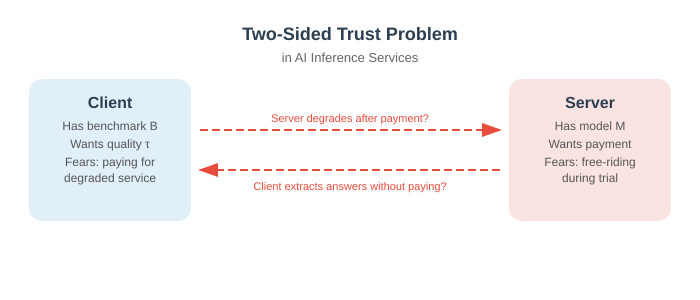

# Accountable AI Inference Services via Smart Contracts

### Enforcing Pre- and Post-Purchase Quality Guarantees for AI Models

**Vincenzo Botta, Ivan Visconti, Andrea Vitaletti, Marco Zecchini**
*Sapienza University of Rome*

---

# The AI Inference Service Market

- AI models are increasingly accessed via **subscription-based APIs**
- A typical workflow:
  1. Client evaluates model quality during a **free trial**
  2. Client subscribes and **pays** for continued access

### :warning: The Hidden Trust Problem

**Before payment:** client must verify quality — but server fears giving away answers for free.

**After payment:** client fears server may degrade the model to cut costs.

---

# A Two-Sided Vulnerability

**Malicious Server can:**
- Use a strong model during trial, swap to a weaker one after payment
- Replay cached answers if client repeats queries

**Malicious Client can:**
- Extract needed answers during evaluation, then claim quality is too low
- Fabricate complaints to get refunds

---

# Problem Statement

> **Goal:** Design a protocol that simultaneously guarantees:
> - The client cannot extract useful answers without paying
> - The server cannot degrade quality after payment — and will be caught if it does

### :bulb: Key Insight

Separate the query set into **pre-purchase** and **post-purchase** subsets via a **public coin flip**, committed before any model output is seen.

A smart contract on a blockchain acts as a **neutral, incorruptible arbiter**.

---

# ASAI: Accountable Subscription for AI Inference

### Three-phase protocol with three actors

- **Client** — holds private benchmark B and threshold τ
- **Server** — hosts proprietary model M
- **Smart Contract S** — public blockchain, stores commitments, holds deposits, adjudicates disputes

---

# Phase 1 — Commitment & Challenge Reservation

- Client constructs **N pairs** of queries: $(q_i^{(0)}, q_i^{(1)})_{i=1}^{N}$
- Builds a **Merkle tree** over all $2N$ leaves and publishes root $R_Q$
- Commits to benchmark $C_B = \text{Com}(B; r_B)$ and threshold $C_\tau = \text{Com}(\tau; r_\tau)$
- Both parties **lock deposits** into S

**Fair coin-toss** → public bit string $\mathbf{b} \in \{0,1\}^N$
- Bit $b_i = 0/1$ determines which query is **pre-purchase** ($q_i^{pre}$) vs **post-purchase** ($q_i^{post}$)
- Neither party can bias the split

---

# Phase 2 — Private Pre-Purchase Evaluation (2PC)

1. Client reveals $\{q_i^{pre}\}$ with Merkle proofs (proves queries belong to committed set)
2. Server runs model M → produces $\text{Ans}^{pre}$, submits signed commitment $\sigma_1$
3. **Two-Party Computation** evaluates $B(\text{Ans}^{pre}) \geq \tau$ with private inputs on both sides

### :white_check_mark: Output: a single bit b

If $b = 1$: joint attestation α submitted on-chain → client subscribes and pays.

If $b = 0$: no attestation produced, no payment.

Only the **decision bit b** is revealed — no model outputs, no benchmark details.

---

# Phase 3 — Post-Purchase Accountability

If the client suspects model degradation after paying:

1. Client sends post-purchase queries $\{q_i^{post}\}$ to server
2. Server returns **signed answers** $\sigma_i = \text{Sign}_{sk_{Ser}}(H(q_i^{post}), a_i)$
3. Client constructs a **ZK-SNARK proof** $\pi_{complaint}$ certifying:
   - Correct openings of $C_B$, $C_\tau$, Merkle proofs
   - All server signatures are valid
   - $B(\{q_i^{post}\}, \{a_i\}) < \tau$

### :scales: Smart Contract Arbitration
If $\pi_{complaint}$ verifies → **refund client + slash server deposit**

---

# Cryptographic Building Blocks

Each tool plays a specific role:

- **Merkle Tree** — binds all queries upfront
- **Commitments** — hide B and τ from server
- **2PC** — evaluates benchmark without leaking inputs
- **ZK-SNARK** — proves complaint without revealing B, τ, or model details
- **Blockchain** — immutable, neutral arbitration layer

---

# Security Properties

**Six formally proven properties:**

1. Model Privacy
2. Output Privacy
3. Benchmark Privacy
4. Query Binding
5. Non-Repudiation
6. Subscription Accountability

All derived from standard cryptographic assumptions (Definitions 1–8 in the paper).

---

# Detection Probability: Chernoff Bound Analysis

Let $\varepsilon' = \tau - (1-\varepsilon)$ be the **degradation gap**. By the Chernoff bound:

$$\Pr[\text{post-purchase score} \geq \tau] \leq \exp\!\left(-\frac{N\,\varepsilon'^2}{2\mu + \varepsilon'}\right)$$

| $\varepsilon'$ | N needed | Security |
|:---:|:---:|:---:|
| 0.1 | 5,000 | $2^{-128}$ |
| 0.3 | 2,000 | $2^{-128}$ |

The **larger the degradation**, the **fewer queries** needed to catch it.

---

# ZK-SNARK Complaint: Recursive Proof Composition

Three-component design:

**① Benchmark Proof** — opens $C_B$, $C_\tau$; checks $F_1 < \tau$

**② IVC Steps** — per-query Merkle + EdDSA signature verification; pipelined with server responses

**③ Groth16 Aggregation** — single succinct proof for on-chain verification

Implemented in **RISC Zero** (open source)

---

# Experimental Results

Evaluated on Dell PowerEdge R760 (128 cores, 1 TB RAM)
**Complaint over 20 queries, degraded F1-score scenario**

| Component | Time |
|:---|---:|
| Benchmark proof | 6.75 s |
| IVC step (avg. over 20 steps) | 21.54 s |
| Aggregation proof (Groth16) | 26.15 s |
| **End-to-end total** | **≈ 463 s (7.7 min)** |

### :zap: Key Observation

Each IVC step (~21 s) matches the typical **wait time for a server response** → proving work is **fully pipelined** with the subscription interaction. The effective latency perceived by the client is negligible.

Peak RAM: **8.6 GB** (configurable via RISC Zero segment size)

---

# Comparison with Related Work

**ASAI's distinguishing features:**

- Does **not** arithmetize the entire neural network
- Provides **pre-purchase** quality assurance (novel)
- Combines 2PC + Merkle + ZK-SNARK + Smart Contract
- Lightweight: ZK proof generated **only if there is a complaint**
- Fully **model-agnostic** (black-box access to M)

---

# Summary & Contributions

### :trophy: What ASAI Achieves

- **ASAI protocol**: first construction providing both pre- and post-purchase accountability for AI inference services
- **Benchmark and output privacy**: only a single bit disclosed before payment
- **On-chain arbitration**: smart contract enforces refunds and collateral slashing without trust in any party
- **Practical viability**: ZK complaint proof in ~7.7 min, fully pipelined, on commodity hardware

**Open-source implementation** available on GitHub (anonymous submission)
<i class="fa-brands fa-github"></i> `https://anonymous.4open.science/r/secureVerificationModel-25CF`

---

# Future Directions

- **Reduce 2PC overhead** — explore MPC-in-the-head or VOLE-based protocols for the benchmark evaluation step
- **Multi-model accountability** — extend ASAI to ensemble services or model-routing systems
- **Tokenomics integration** — tie collateral slashing to a reputation/staking system for persistent service quality incentives
- **Formal verification** — machine-checked proofs of the protocol security properties
- **Regulatory compliance** — map ASAI guarantees to emerging AI Act audit requirements

---

# Thank You!

### Questions?

<i class="fa-solid fa-at"></i> visconti@diag.uniroma1.it · vitaletti@diag.uniroma1.it · zecchini@diag.uniroma1.it

<i class="fa-brands fa-github"></i> [https://anonymous.4open.science/r/secureVerificationModel-25CF](https://anonymous.4open.science/r/secureVerificationModel-25CF)

**Paper preprint:**
[https://arxiv.org/pdf/XXXX.XXXXX](https://arxiv.org/pdf/XXXX.XXXXX)

---

# Appendix: Smart Contract Interface

The contract S exposes four functions:

| Function | Phase | Action |
|:---|:---:|:---|
| `Initialize` | 1 | Store $R_Q$, $C_B$, $C_\tau$, $C_b$, keys; lock deposits |
| `Settle` | 2 | Verify joint attestation α; set `benchmark_met = true` |
| `Subscribe` | 2→3 | Client-controlled; atomically transfers $d_{Cli}$ to server |
| `Complain` | 3 | Verify $\pi_{complaint}$; if valid, refund + slash $d_{Ser}$ |

Deposits ensure both parties have **skin in the game** throughout the protocol.

---

# Appendix: Formal Security Definitions Used

| Primitive | Key Property Used |
|:---|:---|
| Hash function H | Collision resistance |
| Digital signatures | Unforgeability (EUF-CMA) |
| Merkle tree | Binding (soundness) |
| Commitment scheme | Hiding + Binding |
| Two-Party Computation | Security against malicious adversaries |
| ZK-SNARK | Completeness, Knowledge Soundness, Zero Knowledge |
| Blockchain | Consistency, Immutability, Smart Contract Integrity, Liveness |

All properties stated in Definitions 1–8 (Section 3 of the paper).
