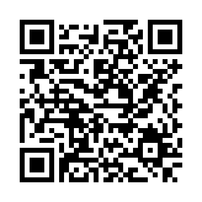

<!--
https://rnd195.github.io/marp-community-themes/theme/beam.html
https://fontawesome.com/icons
-->

# Collective Seed Storage
### A Sustainable Approach to Ex Situ Seed Conservation through Citizen Participation and Distributed Storage

**Andrea Vitaletti**1 **and Khalil Massri**2
*1Sapienza University of Rome, 2Hebron University*

---

# The Need for Seed Diversity

- Over 50,000 edible plants exist worldwide, but **just 15 provide 90% of food energy intake**.
- More than 95% of crop **genetic erosion** studies report changes in diversity, with nearly 80% showing evidence of loss [[1]](https://doi.org/10.1111/nph.17733).
- Crop Wild Relatives (CWRs) hold genetic resources absent from cultivated varieties, useful to improve productivity, resilience and quality.

### :seedling: Genetic diversity
Vital to adapt to climate change, pests, diseases and evolving societal needs

---

# Conservation Strategies

| Criteria | In Situ | Ex Situ |
|----------|---------|---------|
| **Location** | Natural environment / farms | Seed banks, seed vaults, labs |
| **Evolution** | Plants adapt naturally | Static; no natural evolution |
| **Risk of Loss** | Higher (land-use, climate) | Lower (controlled conditions) |
| **Cultural Link** | Strong | Weak or absent |
| **Access & Sharing** | Local and informal | Global, formal (e.g. SMTA) |
| **Best Use** | Wild relatives, landraces | Major crops, backup, breeding |

---

# Seed Banks and the SGSV

- A seed bank safely conserves the genes that make each plant variety unique, and keeps them available for future use.
- The **Svalbard Global Seed Vault (SGSV)** is unanimously considered the global **backup** facility for seed banks worldwide.
- 2023: **1,267,127 samples**, from **>100 genebanks**, representing **>6,000 species**.
- Only depositors can withdraw their own seeds (unlike the Millennium Seed Bank).

---

# Open Problem

- Our analysis of the SGSV **Seed Portal** shows that the vast majority of species have a **single depositor**.
- *Oryza sativa* (Asian rice): **29 depositors**, 171,193 accessions, 136 countries.
- *Hygroryza aristata* (a CWR of rice): **1 depositor**, 4 accessions, 1 country.
- **The Threat:** if a disaster hits both the primary seed bank and the vault, low-redundancy species could be lost forever.

---

# Our Vision: Collective Seed Storage (CSS)

- **Key insight:** the temperature conditions of domestic freezers can meet FAO standards for long-term seed conservation.
- **Shared-economy approach:** repurpose a tiny, idle portion of home freezers to store seeds.
- **First attempt** at a peer-to-peer infrastructure to preserve seed diversity, complementing centralized genebanks.
- Each household becomes a micro-node, increasing redundancy with minimal infrastructure investment.

---

# CSS Requirements

To ensure feasibility and active participation, the system must meet:

1. **Storage Standards (R1):** comply with FAO long-term storage standards (approx. -18°C). Subzero acceptable if ideal conditions unavailable.
2. **User-Friendly (R2):** simple installation with off-the-shelf equipment; only home WiFi assumed.
3. **Longevity (R3):** run for at least 1 year without user intervention.
4. **Incentivization (R4):** support suitable incentive mechanisms to reward long-term participation.

---

# Proof-of-Concept: Architecture

- **Sensor:** DHT22 (temperature/humidity) inside an airtight seed container in the freezer.
- **Sensor Node:** ESP32 Devkit V1 placed *outside* the freezer, connected via three tiny wires (R2).
  - Placing the ESP32 inside hinders WiFi (>40% packet loss) and battery efficiency drops in the cold.
- **Communication:** ESP32 transmits readings via WiFi to a Blockchain smart contract that dispenses incentives (R4).

---

# R1: Storage Conditions

- Monitored a **BOSCH KGN39X23** domestic freezer set to -18°C, samples every 5 minutes.
- After an initial transient, temperature **oscillates** noticeably.
- Ideal Standard 4.2.3 not fully met, but conditions are consistent with **acceptable subzero storage**.

---

# R3: Energy Consumption & Lifetime

- **init task:** ~2400ms @ ~50mA (≈0.03mAh)
- **com task:** ~3160ms @ ~100mA (≈0.09mAh)
- **deep sleep:** 10µA nominal
- 3.6V, 1.5Ah LiFePo4 battery
- With a sleep period **X ≥ 0.73 hours**, the node meets the **1-year lifetime** requirement.

---

# R4: Incentives

- Blockchain-based **lottery**, inspired by DePIN (token-incentivized participatory sensing).
- Users are eligible to enter **only if** their readings stay within an acceptable storage range.
- Minimalistic smart contract deployed on Sepolia testnet, accessed via the Infura API.
- Up to 32 packed readings per transaction, reducing communication overhead.

---

# Broader Impact: UN SDGs

### CSS contributes to several UN Sustainable Development Goals

- **SDG 2 — Zero Hunger:** distributed backup infrastructure against genetic erosion
- **SDG 12 — Responsible Consumption & Production:** reuses existing freezer capacity instead of new infrastructure
- **SDG 13 — Climate Action:** preserves genetic resources needed for climate adaptation
- **SDG 17 — Partnerships for the Goals:** potential integration with the Multilateral System (MLS)

---

# Future Work

- **Long-term storage studies:** how close can domestic freezers get to ideal Standard 4.2.3 conditions? Variability across freezer models.
- **Energy harvesting:** exploit the inside/outside thermal gradient for energy-neutral operation.
- **User studies:** willingness to participate; game-theoretic engagement mechanisms.
- **Institutional integration:** connect CSS with the Multilateral System (MLS) and governance of seed exchanges.
- Evaluate economic costs and long-term participation strategies.

---

# Conclusions

- Even the SGSV, the world's most renowned backup facility, shows **limited redundancy** for many species.
- **CSS** is a shared-economy vision: domestic freezers as a distributed infrastructure for long-term seed storage.
- Our Proof-of-Concept demonstrates the **technical feasibility** of IoT-based monitoring and blockchain-based incentives.
- Acceptable subzero storage conditions are achievable in ordinary domestic freezers.

---

# Thank you!

### Questions?

<i class="fa-solid fa-at"></i> vitaletti@diag.uniroma1.it

<i class="fa-brands fa-github"></i> [https://andreavitaletti.github.io/](https://andreavitaletti.github.io/)

[https://github.com/andreavitaletti/slides/blob/main/ICAISF2026/presentation.pdf](https://github.com/andreavitaletti/slides/blob/main/ICAISF2026/presentation.pdf)

Code: [https://github.com/andreavitaletti/PlatformIO/tree/main/Projects/web3E_SC](https://github.com/andreavitaletti/PlatformIO/tree/main/Projects/web3E_SC)

---

# Image sources

- Slide 1, 6, 12: generated by Gemini
- Slide 2: https://medium.com/thenextnorm/importance-of-genetic-diversity-in-agriculture-b9f88f5fda55
- Slide 4: https://en.wikipedia.org/wiki/Svalbard_Global_Seed_Vault#/media/File:Svalbard_Global_Seed_Vault_February_2025.jpg
- Slide 5: https://doi.org/10.1111/rec.13174
