<!--
https://rnd195.github.io/marp-community-themes/theme/beam.html
https://fontawesome.com/icons
-->

# Collective Seed Storage
### A Sustainable Approach to Ex Situ Seed Conservation through Citizen Participation and Distributed Storage

**Andrea Vitaletti**1 **and Khalil Massri**2
*1Sapienza University of Rome, 2Hebron University*

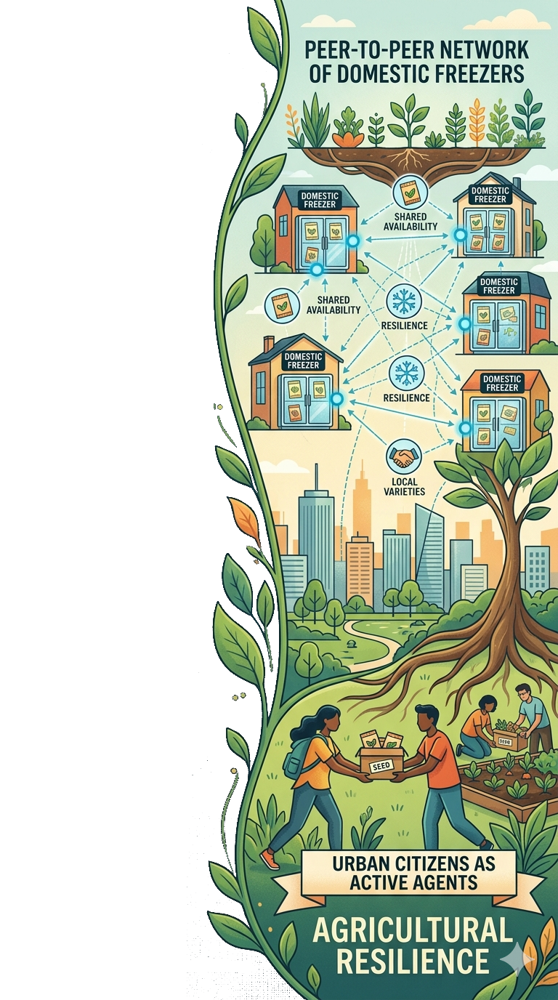

---

# The Need for Seed Diversity

- Over 50,000 edible plants exist worldwide, but **just 15 provide 90% of food energy intake** (e.g., rice, corn, wheat).
- More than 95% of crop **genetic erosion** articles report changes in diversity, with nearly 80% showing evidence of loss [[1]](https://doi.org/10.1111/nph.17733).

### :seedling: Genetic diversity 
Vital to adapt to climate change, extreme weather, pests, and diseases

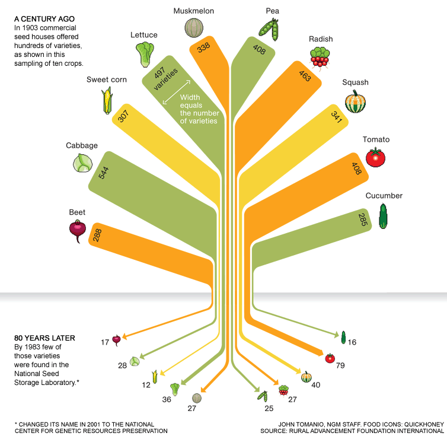

---

# Conservation Strategies

| Criteria | In Situ Conservation | Ex Situ Conservation |
|----------|----------------------|----------------------|
| **Location** | Natural environment / farms | Seed banks, seed vaults |
| **Evolution** | Plants adapt naturally | Static; no natural evolution |
| **Risk of Loss**| Higher (climate, land-use) | Lower (controlled conditions) |
| **Access** | Local and informal | Global access via formal mechanisms |
| **Cost** | Lower short-term cost | Higher cost (infrastructure) |
| **Best Use** | Wild relatives, landraces | Major crops, backup |

---

# Svalbard Global Seed Vault (SGSV)

- A global backup facility for seed banks worldwide.
- Safeguards over 1.2 million samples representing >6,000 plant species.
- Unanimously considered the **backup seed facility that provides the highest standards of safety and security.**

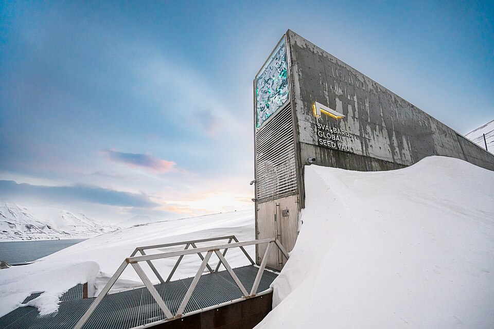

---

# Open Problem

- The vast majority of species, mostly CWR in the SGSV, have only a **single depositor** [[2]](https://seedvault.nordgen.org/Search).
- **The Threat:** if a disaster hits both the primary seed bank and the vault, the species could be lost.

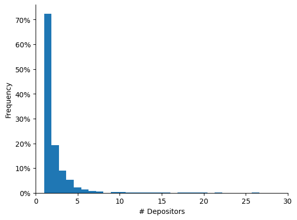

---

# Orthodox Seeds and Storage

- **Orthodox Seeds:** Approximately 90% of species can retain viability if dried and kept at low temperatures (e.g., wheat, rice, legumes).
- **Storage Standards:** FAO recommends [[3]](https://doi.org/10.4060/cc0021en) long-term storage at **-18°C and 15% relative humidity.**
- Subzero freezers are acceptable if ideal conditions are not available.

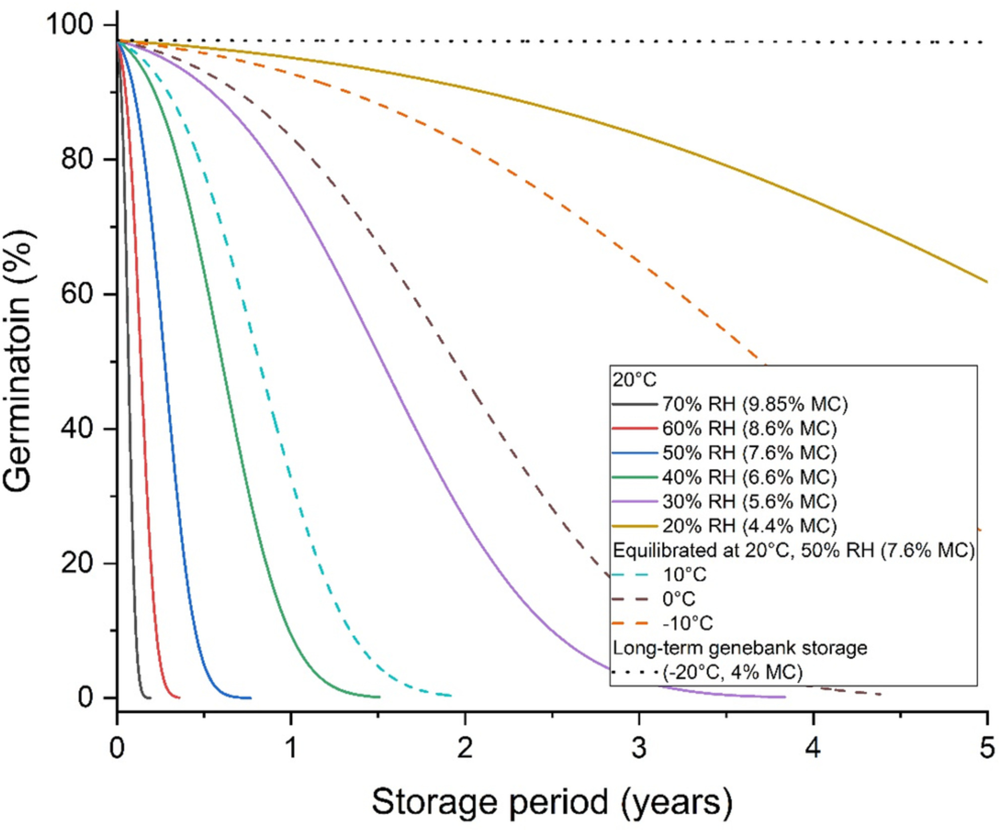

---

# Collective Seed Storage (CSS)

- **Domestic freezers provide suitable conditions for seed conservation** 
- **Vision:** Each household becomes a micro-node in a distributed seed conservation system. Citizens are active contributors to food system resilience and biodiversity conservation
- **Shared Economy Approach:** Sharing a tiny, idle portion of home freezers for seed preservation, to drastically increase redundancy and the overall availability of seeds with minimal infrastructure investments.

---

# CSS Requirements

To ensure feasibility and active participation, the system must meet:

1. **Storage Standards (R1):** FAO long-term storage conditions (approx. -18°C). Subzero acceptable.
2. **User-Friendly (R2):** Simple installation using off-the-shelf equipment and home WiFi.
3. **Longevity (R3):** Operate for at least 1 year without user intervention (battery life).
4. **Incentivization (R4):** Implement mechanisms to reward users for their long-term commitment.

---

# R1: Storage

<!--
- **Experiment:** Monitoring a Bosch domestic freezer set to -18°C.
- **Results:** Subzero conditions are easily met, though temperature fluctuates (as per acceptable secondary standards).
--> 

- FAO standards :neutral_face:
- Subzero conditions :slightly_smiling_face:

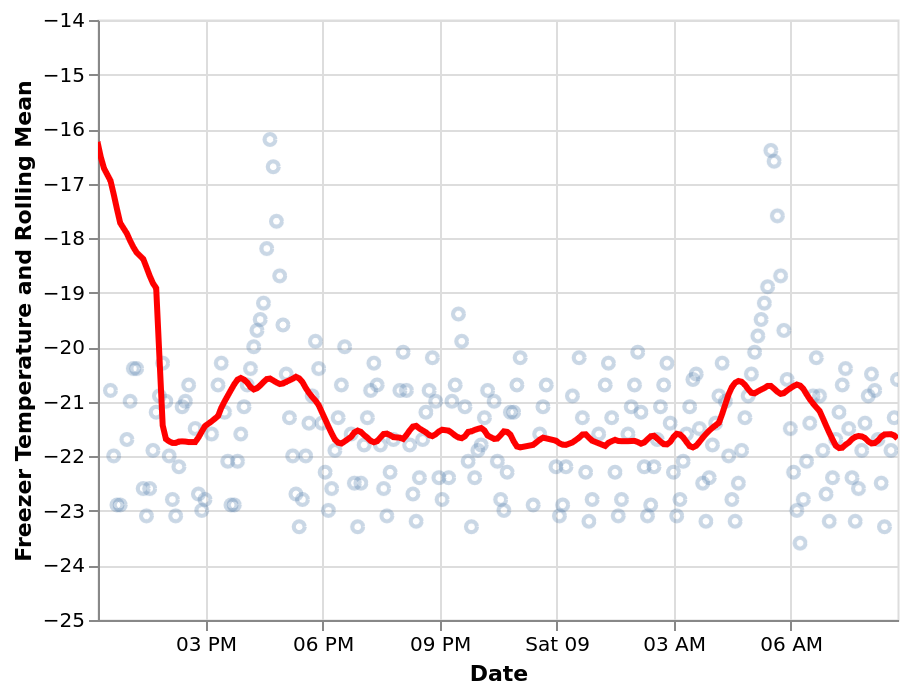

---

# Architecture

<!--
https://www.emojicheatsheet.com/
https://github.com/ikatyang/emoji-cheat-sheet
-->

- R2: friendly  :slightly_smiling_face:

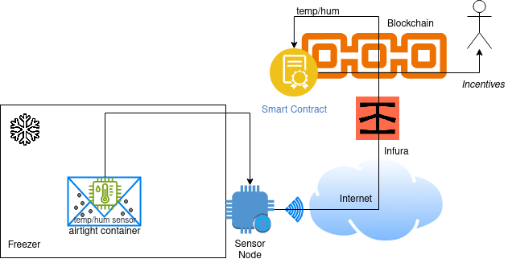

---

# R3: Lifetime 

- **> 1 year** :slightly_smiling_face:
- 1.5Ah LiFePo4 battery
- Duty Cycle: active period about 6 seconds, sleep period >0.73 hours

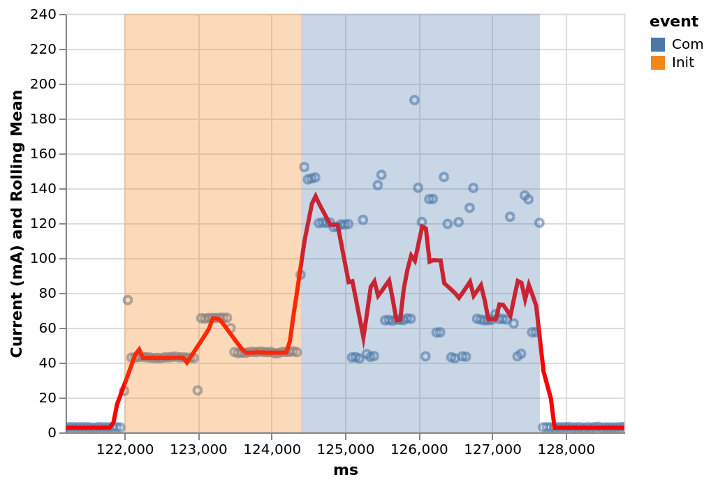

---

# R4: Incentive

- Blockchain Lottery :neutral_face:

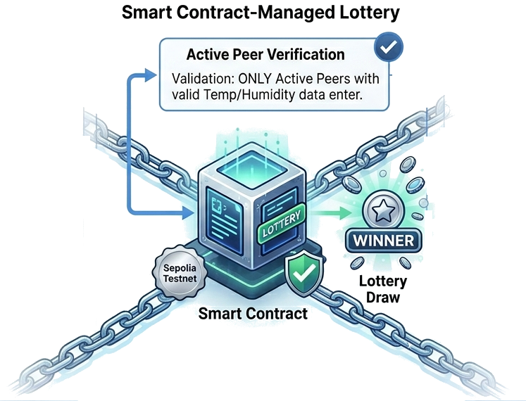

---

# Conclusions

- CSS can support the preservation of seed diversity by transforming urban citizens into "active" agents of agricultural resilience. 
- Households become micro-nodes within a distributed seed conservation system
- Our Proof-of-Concept demonstrates the feasibility of the core technical components underlying this vision.

---

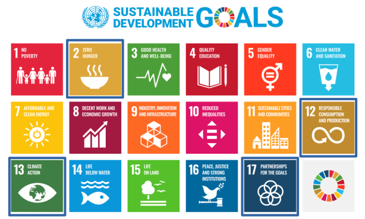

---

# A recent visit to the seed bank at Rome's Botanic Garden

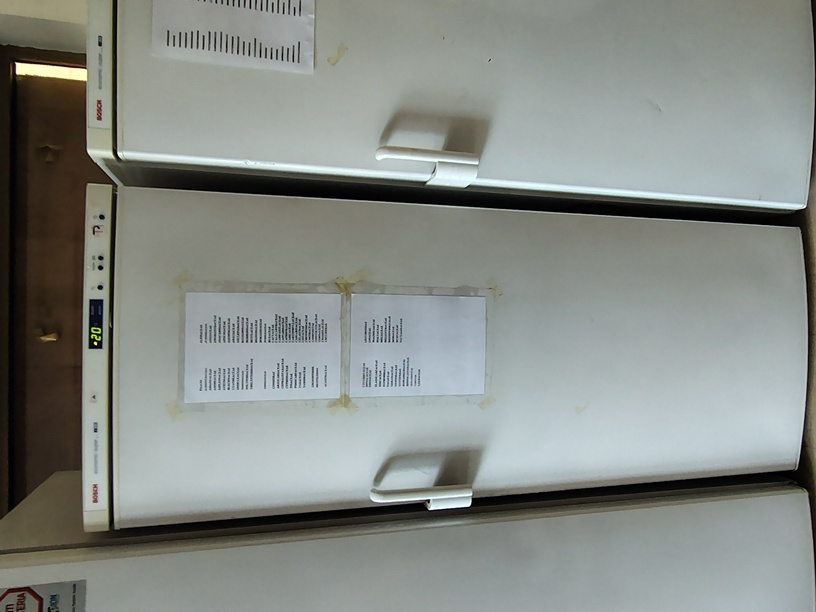
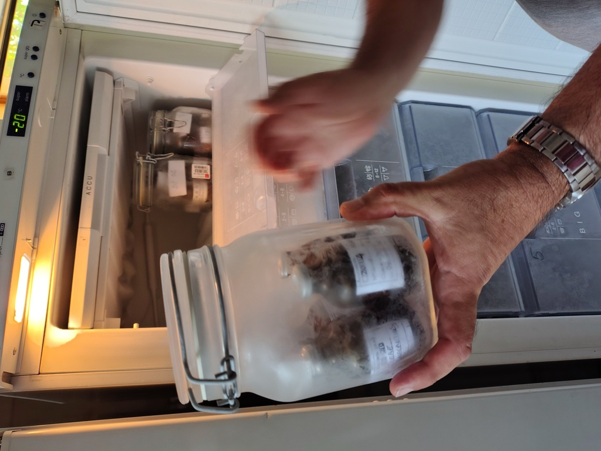
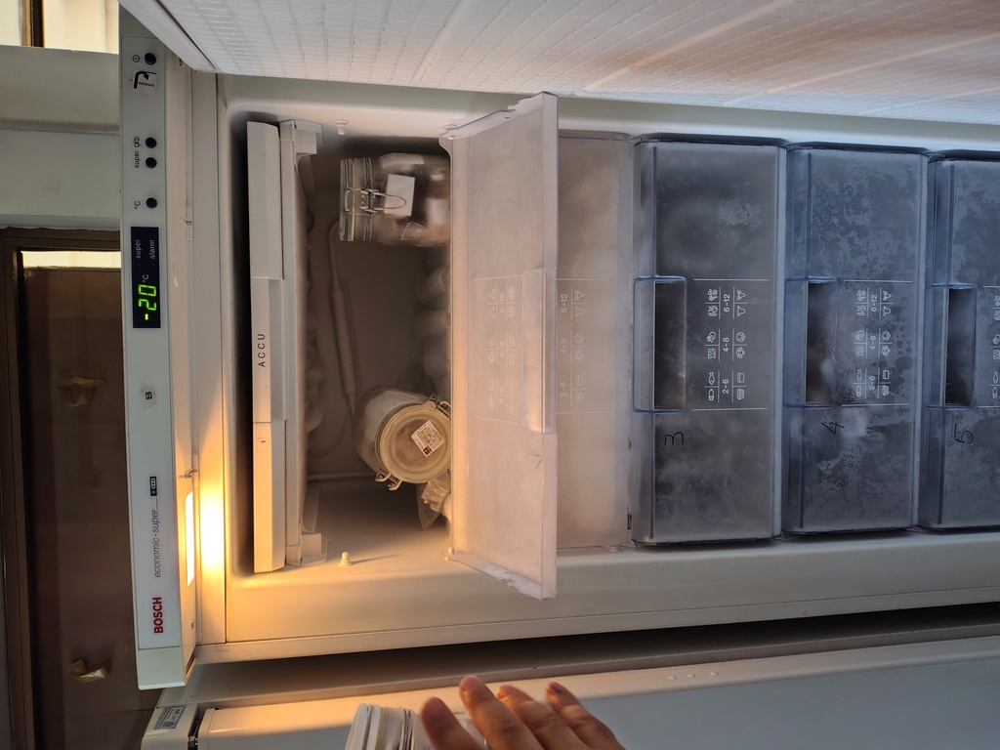

---

# Discussion

- A modern approach to seed preservation should promote <u>more active citizen participation</u> (e.g., Seed Guardians) that extends beyond the mere act of storage.
-  Although the preservation of seeds in domestic freezers is a novel and valuable practice, it may remain, to some extent, a "passive" activity. 

___

# Future Vision: [www.seedpeers.net](https://www.seedpeers.net/)

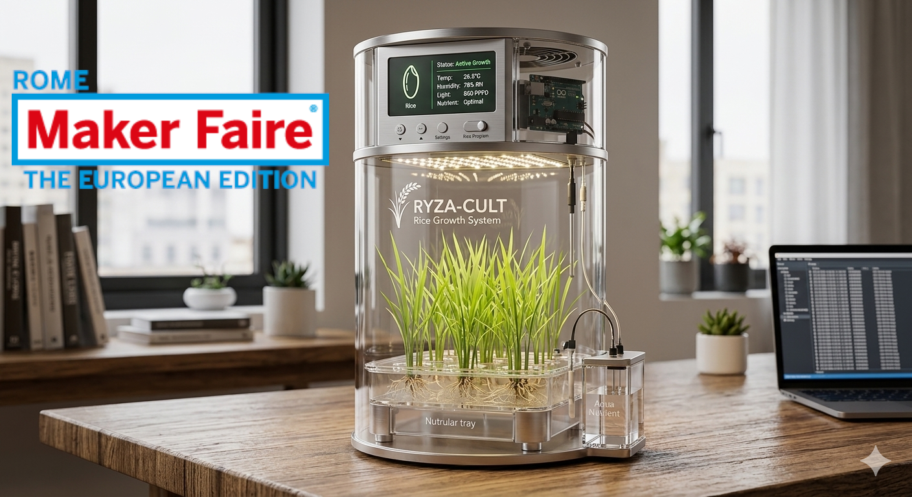

--- 

# Thank you!

### Questions?

<!-- :envelope: vitaletti@diag.uniroma1.it -->
<i class="fa-solid fa-at"></i> vitaletti@diag.uniroma1.it
<i class="fa-brands fa-github"></i> [https://andreavitaletti.github.io/](https://andreavitaletti.github.io/)

[https://github.com/andreavitaletti/slides/tree/main/ICAISF2026](https://github.com/andreavitaletti/slides/tree/main/ICAISF2026)

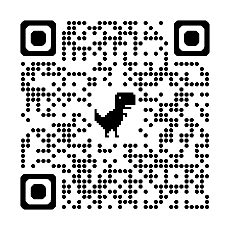

---

# Image sources

- Slide 6: https://doi.org/10.1111/rec.13174
- Slide 2: https://medium.com/thenextnorm/importance-of-genetic-diversity-in-agriculture-b9f88f5fda55
- Slide 4: https://en.wikipedia.org/wiki/Svalbard_Global_Seed_Vault#/media/File:Svalbard_Global_Seed_Vault_February_2025.jpg
