<!--
https://rnd195.github.io/marp-community-themes/theme/beam.html
-->

# Collective Seed Storage
### Urban Citizens as Active Agents of Agricultural Resilience

**Andrea Vitaletti and Ioannis Chatzigiannakis**
*Sapienza University of Rome*

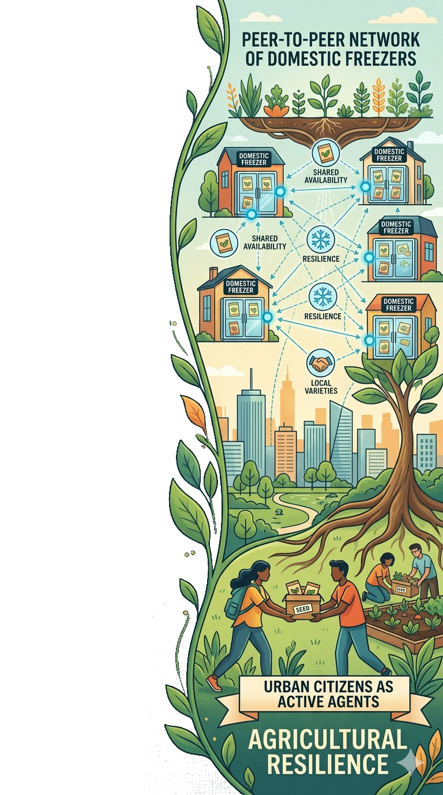

---

# The Need for Seed Diversity

- Over 50,000 edible plants exist worldwide, but **just 15 provide 90% of food energy intake** (e.g., rice, corn, wheat).
- More than 95% of crop **genetic erosion** articles report changes in diversity, with nearly 80% showing evidence of loss [[1]](https://doi.org/10.1111/nph.17733).

### :seedling: Genetic diversity 
Vital to adapt to climate change, extreme weather, pests, and diseases

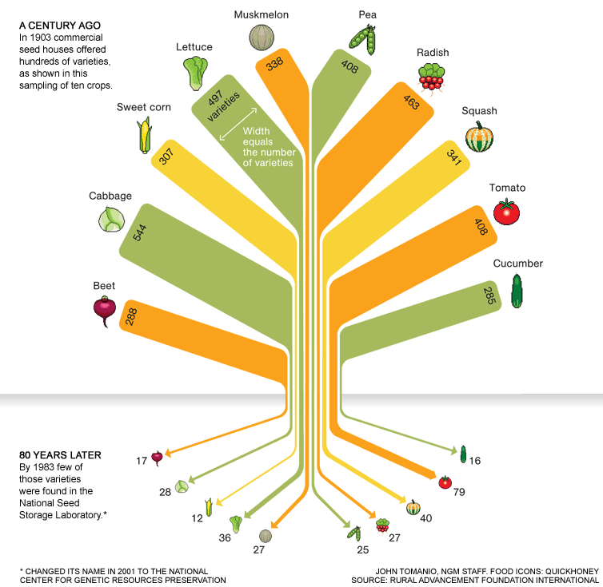

---

# Conservation Strategies

| Criteria | In Situ Conservation | Ex Situ Conservation |
|----------|----------------------|----------------------|
| **Location** | Natural environment / farms | Seed banks, seed vaults |
| **Evolution** | Plants adapt naturally | Static; no natural evolution |
| **Risk of Loss**| Higher (climate, land-use) | Lower (controlled conditions) |
| **Access** | Local and informal | Global access via formal mechanisms |
| **Cost** | Lower short-term cost | Higher cost (infrastructure) |
| **Best Use** | Wild relatives, landraces | Major crops, backup |

---

# Svalbard Global Seed Vault (SGSV)

- A global backup facility for seed banks worldwide.
- Safeguards over 1.2 million samples representing >6,000 plant species.
- Unanimously considered the **backup seed facility that provides the highest standards of safety and security.**

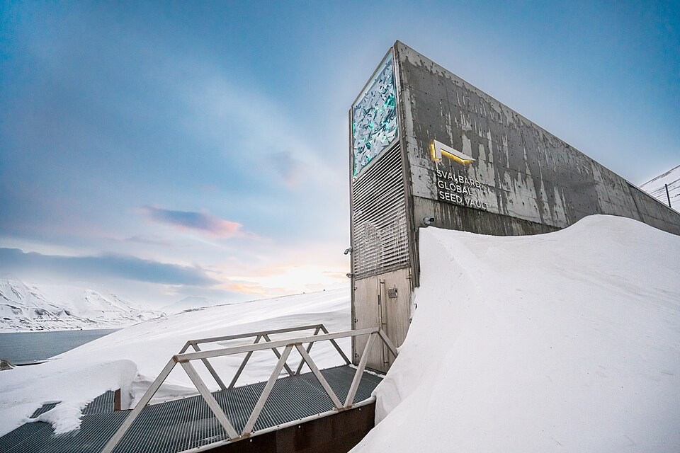

---

# The Open Problem: Limited Redundancy

- The vast majority of species, mostly CWR in the SGSV, have only a **single depositor** [[2]](https://seedvault.nordgen.org/Search).
- **The Threat:** if a disaster hits both the primary seed bank and the vault, the species could be lost.

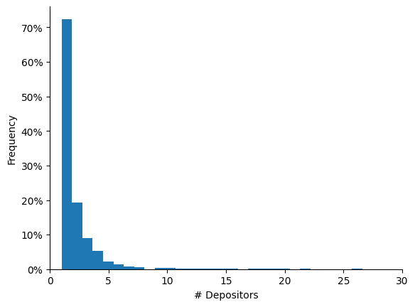

---

# Orthodox Seeds and Storage

- **Orthodox Seeds:** Approximately 90% of species can retain viability if dried and kept at low temperatures (e.g., wheat, rice, legumes).
- **Storage Standards:** FAO recommends [[3]](https://doi.org/10.4060/cc0021en) long-term storage at **-18°C and 15% relative humidity.**
- Subzero freezers are acceptable if ideal conditions are not available.

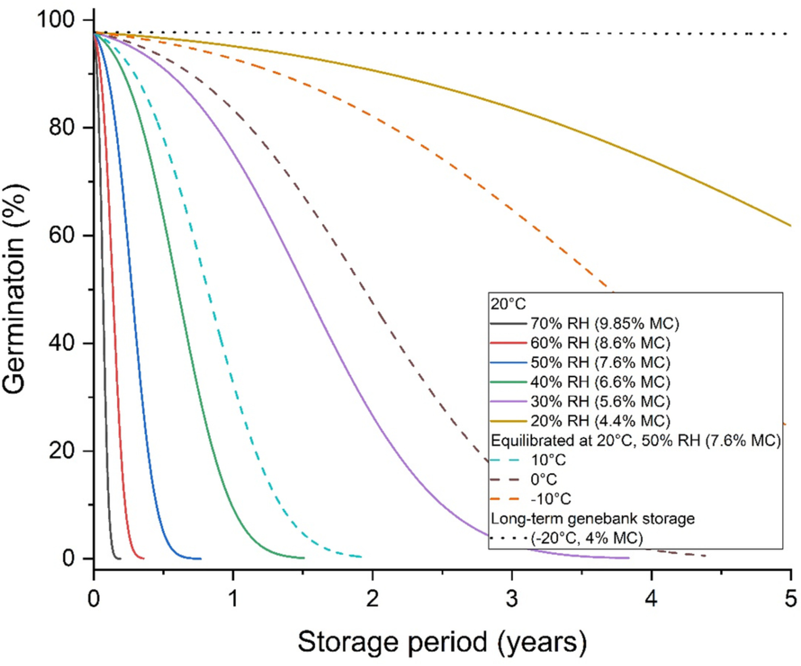

---

# Collective Seed Storage (CSS)

- **Domestic freezers provide suitable conditions for seed conservation** 
- **Vision:** Each household becomes a micro-node in a distributed seed conservation system. Cittizens are active contributors to food system resilience and biodiversity conservation
- **Shared Economy Approach:** Sharing a tiny, idle portion of home freezers for seed preservation, to drastically increase redundancy and the overall availability of seeds with minimal infrastructure investments.

---

# CSS Requirements

To ensure feasibility and active participation, the system must meet:

1. **Storage Standards (R1):** FAO long-term storage conditions (approx. -18°C). Subzero acceptable.
2. **User-Friendly (R2):** Simple installation using off-the-shelf equipment and home WiFi.
3. **No Intrusive Cables (R3):** Minimal wiring to simplify placement in the freezer.
4. **Longevity (R4):** Operate for at least 1 year without user intervention (battery life).
5. **Incentivization (R5):** Implement mechanisms to reward users for their long-term commitment.

---

<!--
# Proof-of-Concept: Architecture

- **Sensor Node:** ESP32 Devkit V1 placed *outside* the freezer (to preserve WiFi signal and battery efficiency).
- **Sensor:** DHT22 (temperature and humidity) placed *inside* an airtight seed container in the freezer.
- **Connection:** Connected via three tiny wires (R3).
- **Communication:** ESP32 transmits data via WiFi (R2) to a blockchain Smart Contract.

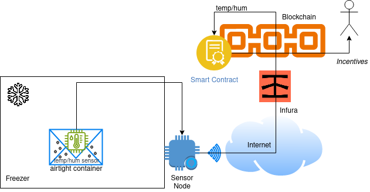

---

# Architecture

---

-->

# Architecture

<!--
https://www.emojicheatsheet.com/
https://github.com/ikatyang/emoji-cheat-sheet
-->

- R2: friendly  :slightly_smiling_face:
- R3: no cables :neutral_face:

---

# R1: Storage

<!--
- **Experiment:** Monitoring a Bosch domestic freezer set to -18°C.
- **Results:** Subzero conditions are easily met, though temperature fluctuates (as per acceptable secondary standards).
--> 

- FAO standards :neutral_face:
- Subzero conditions :slightly_smiling_face:

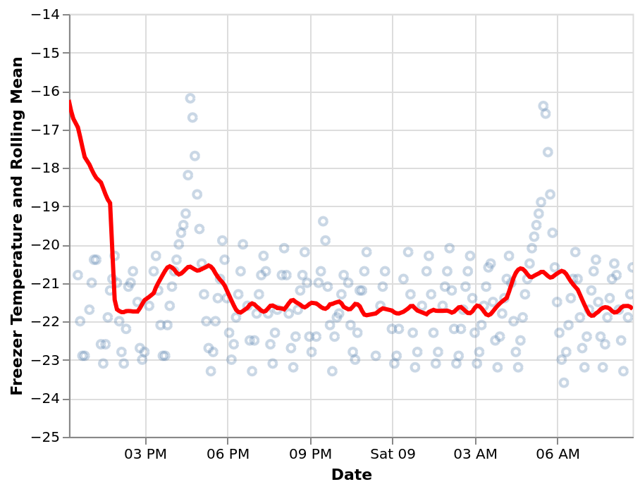

---

<!--
# R4. Energy Consumption

- **Challenge:** Node must run for >1 year on a 3.6V LiFePo4 battery.
- **Strategy:** Low duty cycle using Deep Sleep (10µA nominal).
- **Active Cycle:**
  - **Init Task:** ~2400ms at ~50mA.
  - **Com Task:** ~3160ms at ~100mA.
- **Result:** With a sleep period of >0.73 hours, the system meets the 1-year lifetime requirement.

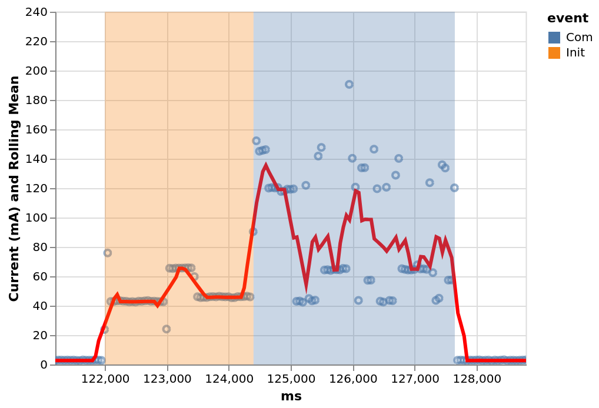

---

-->

# R4: Lifetime 

- **> 1 year** :slightly_smiling_face:
- Duty Cycle: active period about 6 seconds, sleep period >0.73 hours

---

# R5: Incentive

- Blockchain Lottery :neutral_face:

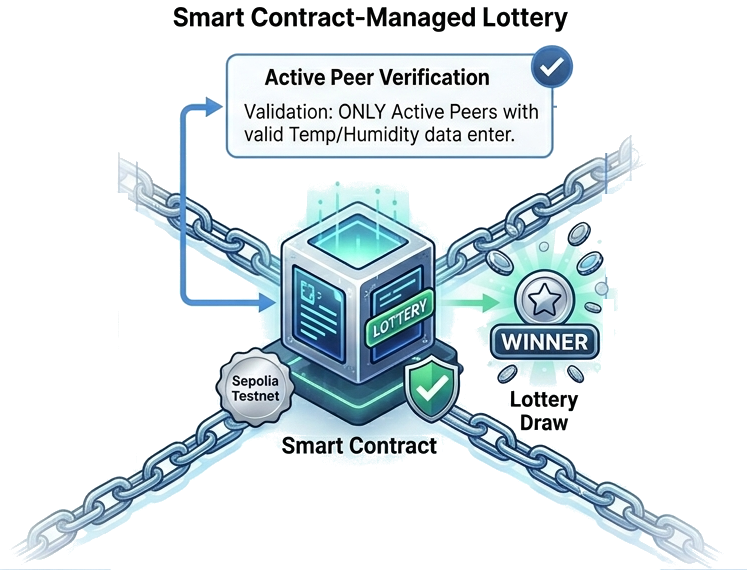

---

<!--

# 12. Future Work

- **Hardware Optimization:** Transition to custom, ultra-low-power boards to improve battery life.
- **Environmental Studies:** Further investigate the impact of domestic freezer temperature fluctuations on seed longevity.
- **Advanced Incentives:** Develop more sophisticated game-theoretic gamification and tokenomics.
- **Institutional Integration:** Connect CSS with the Multilateral System (MLS) to formalize seed exchanges.

---

# 13. Broadening Citizen Participation

- **Beyond Storage:** CSS represents the first step toward hands-on participation.
- **Knowledge Sharing:** IoT network creates a collective base of objective storage data.
- **Next Steps:** Expanding the CSS framework to encourage seed regeneration, cultivation, and deeper engagement.
- Empowering "Seed Guardians" globally to actively safeguard our agricultural future.

---

# 14. Conclusions

- **Redundancy is Critical:** The reliance on single depositors poses a threat to global seed security.
- **CSS works:** The Proof-of-Concept demonstrates that domestic freezers can feasibly monitor and maintain adequate conditions.
- **Scalable Solution:** A shared economy approach combined with IoT and Web3 incentives offers a resilient, distributed infrastructure to protect global crop diversity.

---

-->

# Conclusions

- CSS can support the preservation of seed diversity by transforming urban citizens into "active" agents of agricultural resilience. 
- Households become micro-nodes within a distributed seed conservation system
- Our Proof-of-Concept demonstrates the feasibility of the core technical components underlying this vision.

---

# Discussion

- A modern approach to seed preservation should promote <u>more active citizen participation</u> (e.g., Seed Guardians) that extends beyond the mere act of storage.
-  Although the preservation of seeds in domestic freezers is a novel and valuable practice, it may remain, to some extent, a "passive" activity. 
<!--
- CSS can initiate structured knowledge sharing on effective seed preservation. 
- Quantitative, objective data can support evidence-based practices and serve as a foundation for more active citizen engagement.
-->
___

<!-- 

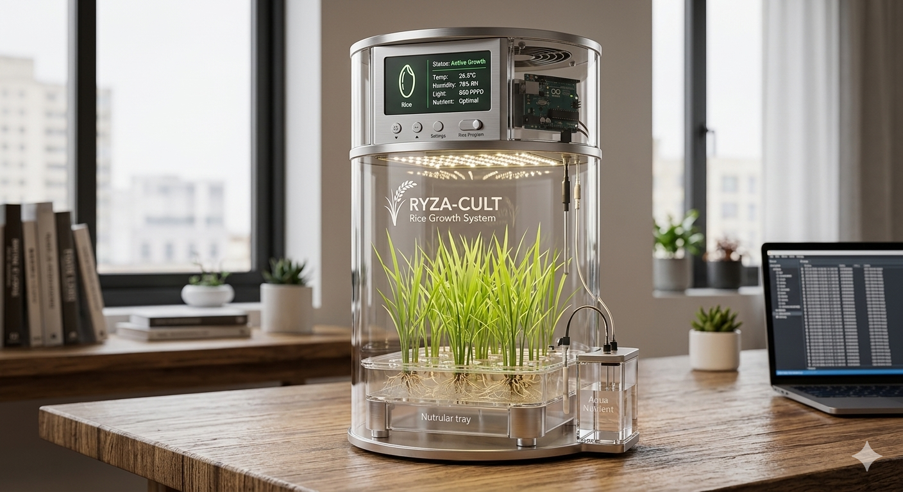

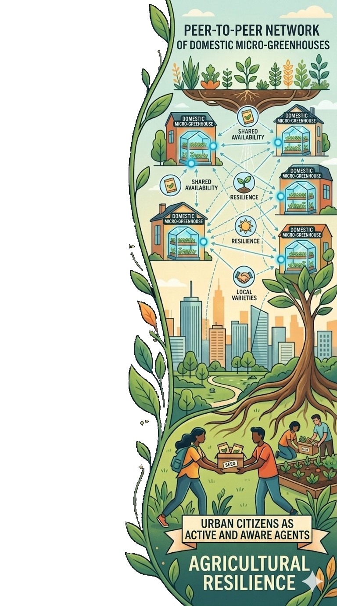

---

-->

# Future Vision

--- 

# Thank you!

*Questions?*

:envelope: vitaletti@diag.uniroma1.it

[https://github.com/andreavitaletti/slides/blob/main/ICSSC2026/presentation.pdf](https://github.com/andreavitaletti/slides/blob/main/ICSSC2026/presentation.pdf)

[https://arxiv.org/pdf/2501.15962](https://arxiv.org/pdf/2501.15962)

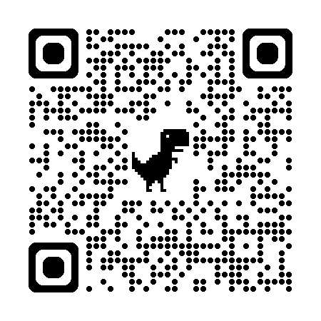
