# Digital Twin of an Ultrasonic Fermentation System
### A Proof of Concept 

F.S. Sconocchia Pisoni, D. Appolloni, F. Ortenzi, M.J. Guillén,
A. Contaldo, B. Morozzo della Rocca, **A. Vitaletti**

*Sapienza University of Rome · University of Rome Tor Vergata · Yeastime Srl*

---

# Context: Beer Fermentation & Ultrasound

- Beer fermentation is a **slow, resource-intensive** industrial process: experiments take days and are costly to repeat
- **Ultrasound technology** (20–50 kHz, low power) is a promising tool to accelerate yeast activity

**[Yeastime](https://yeastime.com/)** estimates: a 30% reduction in fermentation time in craft breweries could lead to cost savings of approximately **10–15%**

- Key effects: improved mass transfer, increased cell permeability, reduced inhibitory metabolites
- This work presents the **first digital twin tailored to an ultrasound-treated fermentation system**

---

# What is a Digital Twin?

A **digital twin** is a virtual representation of a physical system that stays continuously synchronised through real-time data.

### <i class="fa-solid fa-lightbulb"></i> Key Benefit
Physical fermentation trials are **slow and expensive**, the digital twin complements them with **rapid simulation and intelligent actuation**.

---

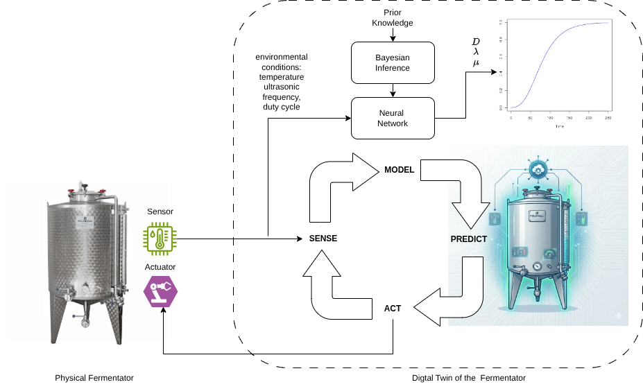

---

# The Dataset

Biological datasets are limited by **slow, manual sampling** each growth curve takes days

### <i class="fa-solid fa-triangle-exclamation"></i> Data Scarcity Challenge
~100 data points: approximately **100× smaller** than the reference study [Palacios et al., 2014]

Classical training is ineffective: high risk of overfitting.

--- 

# The Dataset

| Feature | Description |
|---------|-------------|
| Ultrasound duty cycle | Fraction of time transducer is active |
| Irradiation frequency | Ultrasonic frequency applied (normalised) |
| Temperature | Medium temperature (normalised) |
| Initial / final OD | Yeast density measured at 600 nm |

> Points sharing the same duty cycle, frequency, and initial density belong to the **same biological growth curve**: treated as a group in cross-validation.

---

# Predictive Model: Gompertz + Bayesian NN

The core of the digital twin is a **Gompertz growth model** whose parameters, **D** = total growth amplitude, **μ** = max growth rate and **λ** = lag time,  are inferred by a Bayesian neural network:

$$E[N_t \mid N_0, D, \mu, \lambda] = N_0 + D \cdot \exp\!\left(-\exp\!\left(1 + \frac{\mu e (\lambda - t)}{D}\right)\right)$$

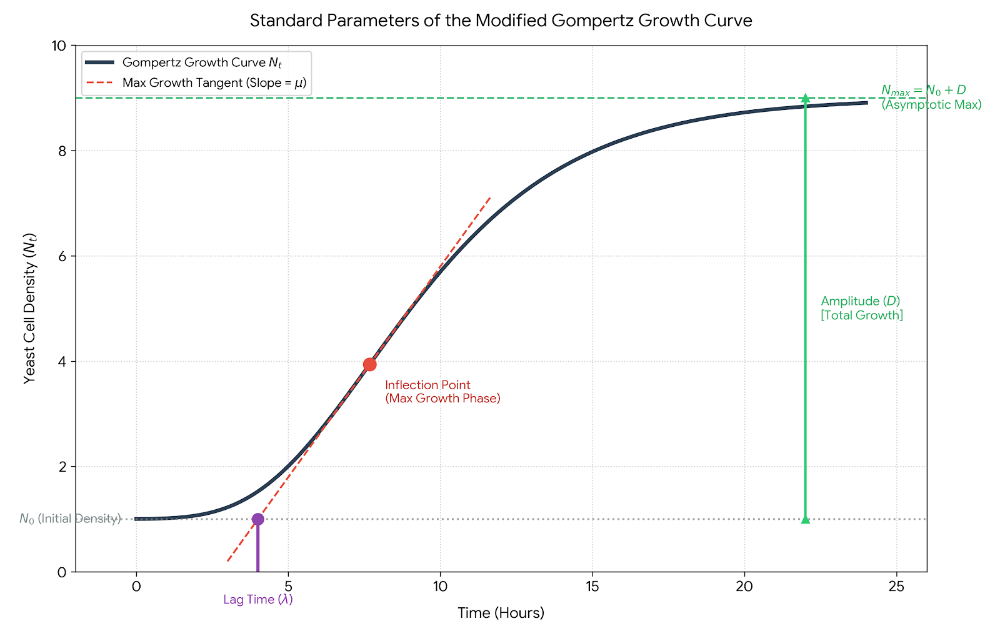

---

# Priors

We have "clear", physical intuition for the outputs ($D$, $\mu$, $\lambda$), but we have zero biological intuition for what individual neural network weights ($w$) should look like. 

Translate a Prior on the Output Space into a Prior on the Parameter Space via the Likelihood function and MCMC sampling.

---

# Detour

The posterior probability of a set of weights $\mathbf{w}$ given the observed fermentation data $y$ is:

$$p(\mathbf{w} \mid y) \propto p(y \mid \mathbf{w}) \cdot p(\mathbf{w})$$

- $p(y \mid \mathbf{w})$ is the Likelihood: How well do the weights explain the raw sensor data?
- $p(\mathbf{w})$ is the Weight Prior

If a randomly proposed step in the weights ($\mathbf{w}^*$) causes the network to output an impossible value for $D$, $\mu$, or $\lambda$, the mathematical probability of that weight configuration is zero. Therefore, the biological output limits act as a filter that shapes the allowed weight space.

---

# Monte Carlo (MCMC) Sampling

Because we can't analytically calculate how to constrain the weights to get the right outputs, we let the Random Walk Metropolis algorithm discover the valid weight spaces through exploration.

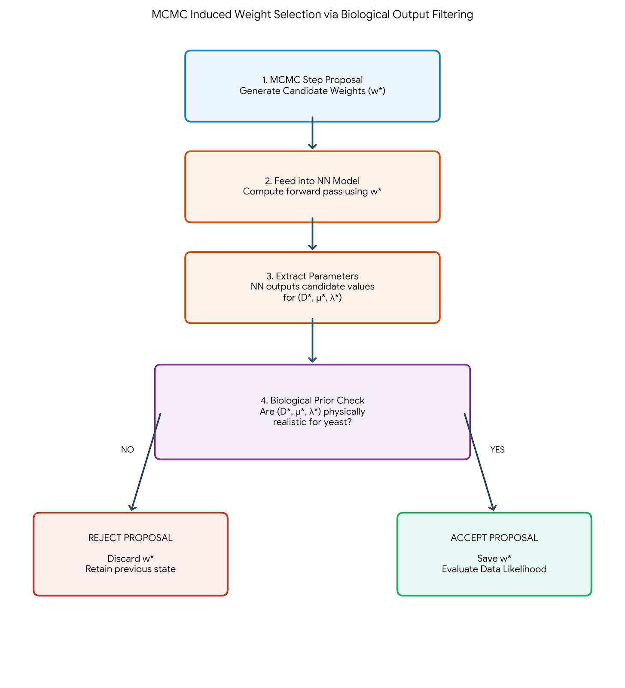

---

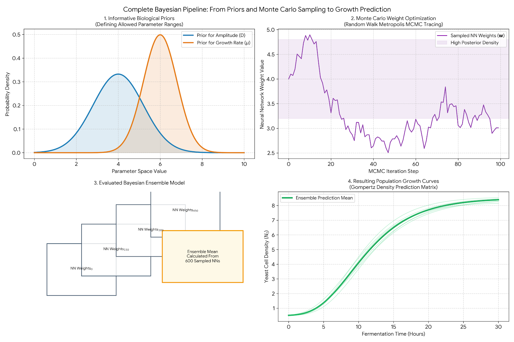
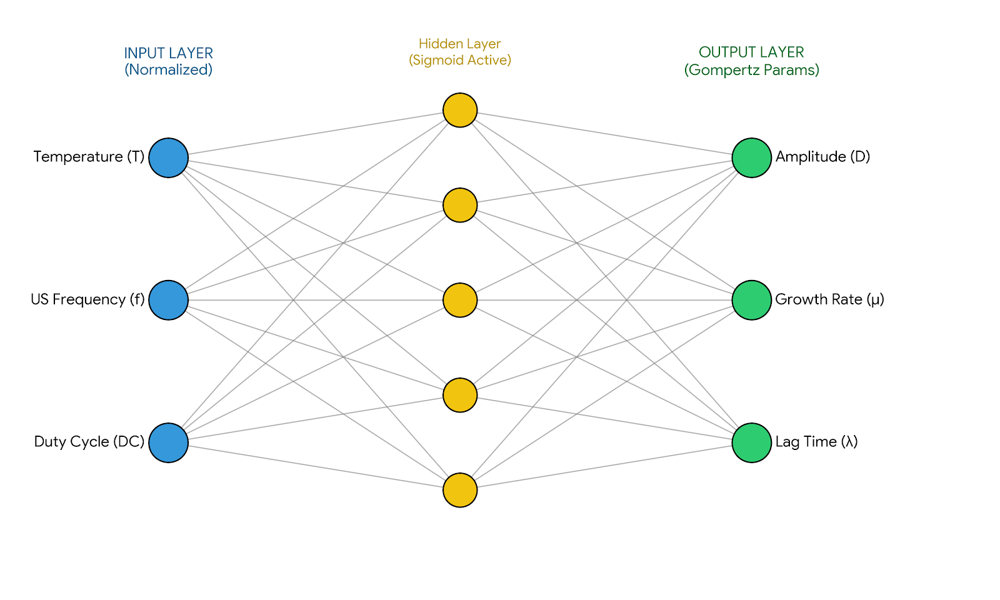

---

# Bayesian Inference Pipeline

Given the **limited dataset**, classical training is ineffective. We adopt [Palacios et al., 2014]:

1. **Prior assignment** — probability distributions encode biological domain knowledge
2. **Random Walk Metropolis** — explores the posterior to find valid weight configurations; Metropolis-Hastings criterion escapes local maxima
3. **Network ensemble** — each accepted MCMC state instantiates a distinct NN outputting D, μ, λ
4. **Final prediction** — parameters averaged across all sampled networks → Gompertz curve

For **small datasets**, highly informative priors are essential. For larger datasets, weakly informative priors such as $\mathcal{N}(0, 100)$ are sufficient — as also recommended in [Palacios et al.].

---

# Informative Priors Matter

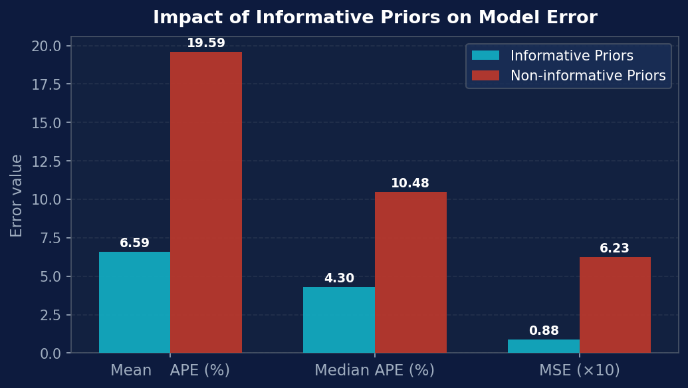

Removing informative priors causes a **~7× increase in MSE**:

- Mean Absolute Percentage Error (Mean APE)
- Median Absolute Percentage Error (Median APE)
- Mean Square Error (MSE)

---

### <i class="fa-solid fa-triangle-exclamation"></i> Takeaway
In fermentation, experiments are too slow to generate large datasets — **biological prior knowledge is the only practical regulariser**.

---

# Model Performance: 5-Fold Cross-Validation

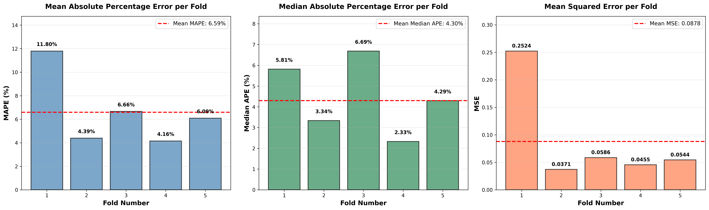

> MSE is ~88× higher than [Palacios et al.] — attributable to dataset size (~100× smaller), single MCMC chain, and optical density (OD) measurement scale differences.

---

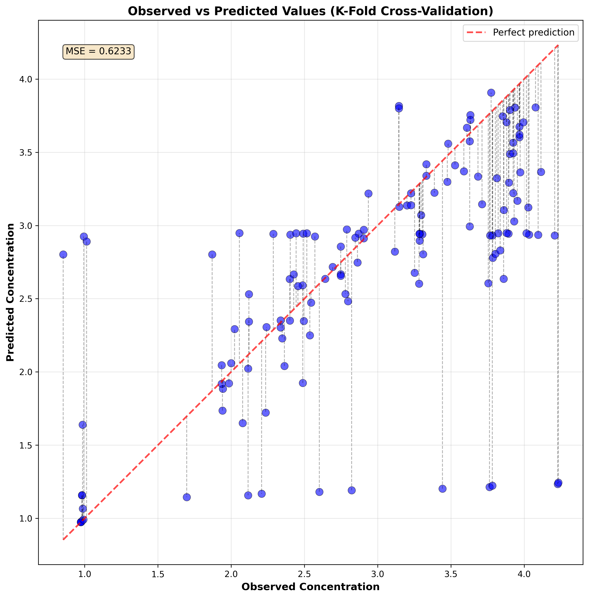
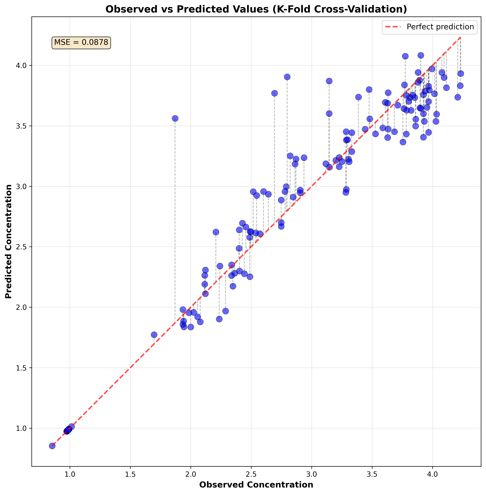

---

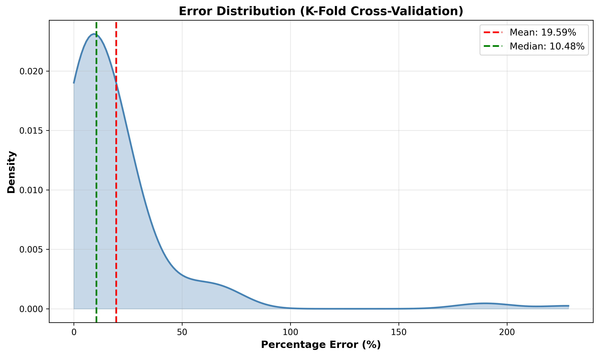
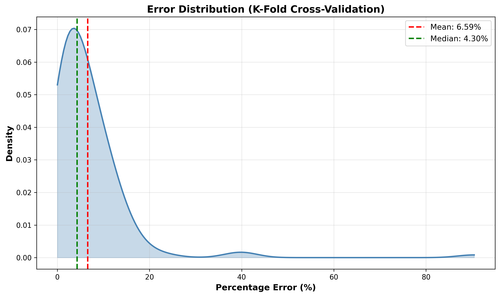

---

# Predicted vs. Observed Growth Curve

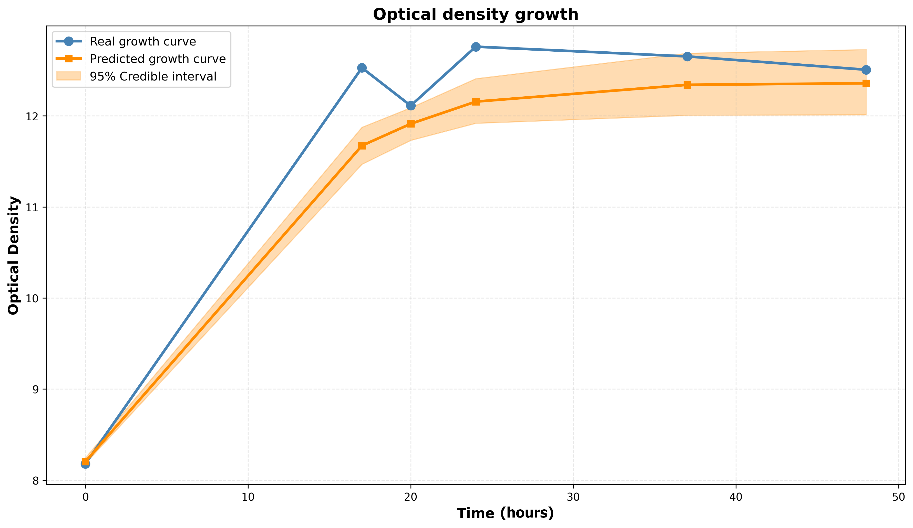

### <i class="fa-solid fa-circle-check"></i> Validation
**The model demonstrates Feasibility for small-data bioprocess prediction**: a solid foundation for a fully autonomous digital twin.

---

# Actuation: Closing the Loop

The digital twin controls the **ultrasonic stimulation parameters**:

- <i class="fa-solid fa-wave-square"></i> **Frequency** — piezoelectric transducer driven at resonance via PWM square wave (ESP32 + H-bridge amplifier)
- <i class="fa-solid fa-sliders"></i> **Duty cycle** — delivered as energy bursts modulated at 150 Hz
- <i class="fa-solid fa-thermometer-half"></i> **Temperature** — monitored; closed-loop thermal control is left for future work

**Accelerating yeast growth** shortens the production cycle → significant economic benefit. The digital twin enables testing actuation strategies **without costly physical trials**.

---

# Conclusions

- First **proof of concept** digital twin for an ultrasonic fermentation system
- Bayesian NN + Gompertz model **effective under data scarcity** (~100 points)
- Informative priors reduce MSE by **~7×** vs. non-informative baseline
- Real-time sensing pipeline (ESP32, piezoelectric disk, Dallas probe) **validated on physical fermenter**

### <i class="fa-solid fa-scale-balanced"></i> Core Message
The digital twin enables **faster, cheaper, smarter** fermentation optimisation — complementing slow physical experiments with rapid simulation and autonomous actuation.

---

# Future Work

- <i class="fa-solid fa-database"></i> **Expand dataset** — collect more growth curves to relax prior constraints and improve generalisation
- <i class="fa-solid fa-eye"></i> **Automate OD sensing** — currently manual; real-time density measurement is the key bottleneck for full automation
- <i class="fa-solid fa-thermometer-half"></i> **Integrate thermal control** — close the temperature actuation loop
- <i class="fa-solid fa-arrows-spin"></i> **Multiple MCMC chains** — improve posterior exploration beyond the current single-chain implementation
- <i class="fa-solid fa-flask"></i> **Full closed-loop validation** — experimentally validate the feedback-optimisation framework end-to-end

---

# Discussion

- How can **digital twin frameworks** best handle the tension between data scarcity and model accuracy in biological systems?
- What are the practical thresholds at which **Bayesian priors** can be relaxed in favour of data-driven learning?
- How should **ultrasonic actuation parameters** be explored efficiently — can the digital twin guide active learning?
- What does **intelligent environment** design look like for bio-oriented systems such as breweries?
