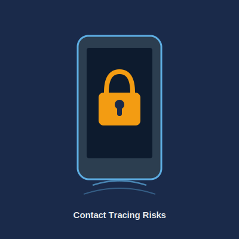
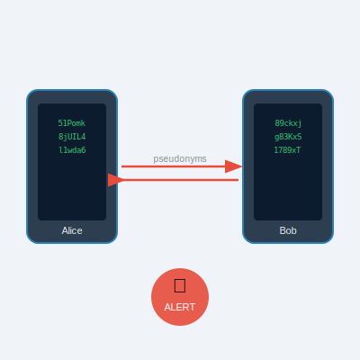
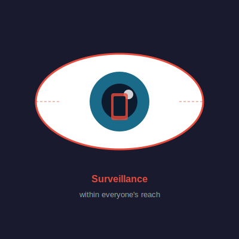

# Anonymous Tracing: A Dangerous Oxymoron
### A Risk Analysis for Non-Specialists

**Bonnetain, Canteaut, Cortier, Gaudry, Hirschi, Kremer, Lacour, Lequesne, Leurent, Perrin, Schrottenloher, Thomé, Vaudenay, Vuillot**

*University of Waterloo · Inria · CNRS · EPFL · Sorbonne Université*

---

# Context: COVID-19 Contact Tracing Apps

- Governments planned mobile apps to **alert people exposed to COVID-19 patients**
- Guiding promise: *privacy-respecting* design using Bluetooth pseudonyms
- Active debate between researchers on **centralised vs. decentralised** approaches

### ⚠️ Our Goal
Clarify what a tracking app **could and could not** guarantee — regardless of its technical implementation

---

# Summary of Claims vs. Reality

| Claim | Reality |
|-------|---------|
| No patient-name database | **TRUE** |
| Data is anonymous | **FALSE** |
| Impossible to find out who infected whom | **FALSE** |
| Impossible to know if a specific person is sick | **FALSE** |
| Impossible to trigger a false alarm | **FALSE** |
| Bluetooth is not a security issue | **FALSE** |
| The system makes large-scale snooping impossible | **FALSE** |

---

# How the App Works

- Each phone **generates a random pseudonym** every ~5 minutes
- Phones in proximity **exchange pseudonyms via Bluetooth** and record the time
- Data stored locally for **14 days**
- If Alice tests positive → app alerts all contacts (e.g. Bob) who received her pseudonyms

### :satellite: Two Models
**Decentralised** (DP3T, Apple/Google): Alice's pseudonyms are published publicly; Bob checks locally.
**Centralised** (ROBERT): Alice's contacts are sent to a server; Bob queries the server.

---

# Data is NOT Anonymous

- Records are **pseudonymised**, not anonymous — a critical distinction under the GDPR:

> *"Personal data which have undergone pseudonymisation … should be considered to be information on an identifiable natural person."*
> — GDPR

- De-anonymisation possible via: **Bluetooth antenna**, **IP address**, or **cross-referencing contacts**

| Type | Example |
|------|---------|
| Nominative | Mr. Bloggs is sick |
| Pseudonymous | Pseudonym 439Hxs is sick |
| Truly anonymous | There are 50,437 cases |

---

# How to Find Out Who Infected You

Even without technical skills, users can infer identities:

**Scenario: The Sole Suspect** — Mr. Smith never leaves home except to shop at the neighbourhood grocery. He receives a notification. Only one person can be responsible: the grocer.

**Scenario: Information Crossing** — Mrs. Jones receives a notification and chats with neighbours and colleagues. She narrows the source to Mr. Attrisk on the 3rd floor and posts her suspicion on social networks.

> These scenarios require **no hacking skills** — only social deduction.

---

# Spying Within Everyone's Reach

Any tracking system that notifies contacts **can be used to monitor a specific person**:

1. Use a **dedicated phone** registered only with the target
2. Keep the phone near the target during an interaction
3. Receive an alert if the target later tests positive

**Scenario: The Job Interview** — The KROOKS company uses a dedicated phone only during the interview. They will be notified if the candidate later tests positive — giving them discriminatory medical information.

---

# False Alarms Are Easy to Trigger

**Scenario: The Anti-System Activist** — Mr. Spart ties his phone to his dog and lets it run in the park all day. He then tests positive, and all dog walkers receive a COVID notification.

**Scenario: The Pupil Bart Symptomson** — Bart borrows a sick person's phone, passes it around his classroom and staffroom. The sick person tests positive → the whole school is forced to close.

### :warning: Impact
False alarms can **target individuals** (athletes, job candidates, negotiators) or **disable entire systems** at scale.

---

# Bluetooth Itself Is a Security Risk

- Bluetooth was **not designed to test physical proximity** (e.g. detects through walls)
- Activating Bluetooth opens **known security vulnerabilities** (e.g. Blueborne, 2017)
- Bluetooth signals can be **captured from over 1 km** with a directional antenna

**Scenario: Burglary** — Ms. Beagle scans for Bluetooth signals before entering Uncle Duck's house. No signal = house is empty.

**Scenario: Mall Surveillance** — A shopping centre uses a Bluetooth antenna at the entrance to detect which customers are running the tracing app.

---

# Towards Large-Scale Snooping

Even without official access, third parties can build shadow registries:

- **By users:** A companion app (GeoTraceVIRUS) pairs GPS coordinates with Bluetooth pseudonyms, revealing where sick patients were.
- **By data companies:** Retailers already use in-store Bluetooth tracking; linking it with tracing pseudonyms creates a private list of sick customers.
- **By cyber criminals:** Malware can blackmail users who declare a positive test, or sell "infect your neighbour" services.

### :no_entry: Key Insight
Most attacks exploit **features** of these systems, not bugs — they cannot be fixed by better cryptography alone.

---

# Conclusions

- These risks are **inherent in how contact tracing works**, not just implementation details
- Cryptography can only address a **limited subset** of these threats
- The scenarios presented are **known, plausible, and easy to execute**

### :balance_scale: The Core Trade-off
The benefits of digital tracing remain **highly uncertain**, while the privacy and security harms are **concrete and foreseeable**. Political choices — not technology — must weigh these.

> *"Information technology must be at the service of every citizen … it should infringe neither on human identity, nor on human rights, nor on privacy, nor individual or public freedoms."*
> — French "Computing and Freedoms" Act, 1978

---

# Discussion

- Should society deploy systems with **known, unavoidable privacy risks** for epidemiological benefits that remain uncertain?
- Who bears responsibility when tracing is **misused by employers, insurers, or criminals**?
- How do we balance **collective health protection** with **individual rights** in a surveillance-capable society?

---

# References

- R. Anderson — *Contact tracing in the real world* (2020)
- S. Landau — *Looking beyond contact tracing to stop the spread* (2020)
- B. Schneier — *Contact tracing COVID-19 infections via smartphone apps* (2020)
- S. Vaudenay — *Analysis of DP3T*, Cryptology ePrint Archive (2020)
- La Quadrature du Net — *Nos arguments pour rejeter StopCOVID* (2020)

<i class="fa-solid fa-globe"></i> [https://risques-tracage.fr/](https://risques-tracage.fr/)

